# 图书馆智能管理系统 — 系统架构设计文档

> **版本**: v1.10  
> **日期**: 2026-06-16  
> **目标等级**: 提高版（含学科知识图谱 + 智能采编系统）  
> **技术栈**: 后端 Spring Boot 3 + MyBatis-Plus，前端 Android Java  
> **项目状态**: ✅ 阶段 0–8 已完成 —— common（基础设施）/ ai（LLM·Embedding·NLP）/ security（认证·RBAC·限流）/ core（图书检索·借阅·预约·推荐）/ knowledge-graph（Neo4j 图谱构建·查询·溯源）/ acquisition（采购预测·查重查缺·智能谈判）/ bootstrap（启动聚合）七模块源码落地，8 模块 BUILD SUCCESS

---

## 目录

1. [引言](#1-引言)
2. [系统概述](#2-系统概述)
3. [技术架构总览](#3-技术架构总览)
4. [模块设计](#4-模块设计)
5. [数据库设计](#5-数据库设计)
6. [接口设计](#6-接口设计)
7. [学科知识图谱子系统](#7-学科知识图谱子系统)
8. [智能采编子系统](#8-智能采编子系统)
9. [安全设计](#9-安全设计)
10. [部署架构](#10-部署架构)
11. [测试策略](#11-测试策略)
12. [附录](#12-附录)

---

## 1. 引言

### 1.1 项目背景

传统图书馆管理系统仅覆盖图书的"采、编、典、流"基础流程，无法满足高校图书馆对学科知识深度挖掘和资源智能化管理的需求。本系统在基础图书管理功能之上，构建**学科知识图谱**实现主题关联网络与文献溯源，并引入**智能采编系统**实现采购预测、查重查缺自动化及电子资源智能谈判，打造面向智慧图书馆的新一代管理平台。

### 1.2 文档目的

本文档作为图书馆智能管理系统的**开发蓝本**，定义系统的架构设计、模块划分、数据模型、接口规范、核心算法及部署策略，指导后续的详细设计、编码实现、测试执行和运维部署。

### 1.3 适用范围

- 后端开发团队：Spring Boot 模块划分与接口实现
- 前端开发团队（Android）：界面设计与交互实现
- 测试团队：测试用例设计与执行
- 运维团队：环境搭建与系统部署

### 1.4 术语定义

| 术语 | 说明 |
|------|------|
| KG | Knowledge Graph，知识图谱 |
| MARC | Machine-Readable Cataloging，机读编目格式 |
| NLP | Natural Language Processing，自然语言处理 |
| SIS | Smart Interview System，智能采编系统 |
| BERT | Bidirectional Encoder Representations from Transformers |
| Neo4j | 图数据库，用于存储知识图谱 |
| RabbitMQ | 消息队列中间件 |
| Elasticsearch | 分布式搜索引擎 |

---

## 2. 系统概述

### 2.1 系统目标

构建一个集**基础图书管理**、**学科知识图谱**、**智能采编**三位一体的高校图书馆系统，实现：

1. **高效检索**：毫秒级全文搜索 + 语义检索
2. **智能推荐**：基于知识图谱协作过滤的个性化推荐
3. **知识发现**：主题关联网络可视化 + 文献溯源链
4. **智能采编**：采购需求预测准确率 ≥ 85%（以 MAPE < 15% 为合格线，MAPE = mean(|实际值-预测值|/实际值)×100%），查重查缺自动化率 ≥ 95%
5. **高可用性**：核心服务可用性 ≥ 99.9%（月度不可用时间 ≤ 43.8 分钟）

### 2.2 功能全景图

```
┌──────────────────────────────────────────────────────────────────────┐
│                      图书馆智能管理系统                                │
├─────────────────┬──────────────────┬─────────────────────────────────┤
│   基础版功能     │   进阶版功能       │   提高版功能                      │
├─────────────────┼──────────────────┼─────────────────────────────────┤
│ 1. 图书检索      │ 7. 学科知识图谱   │ 8. 智能采编系统                   │
│    - 书名搜索    │    - 主题关联网络 │    - 采购需求预测                 │
│    - 作者搜索    │    - 文献溯源路径 │    - 查重/查缺自动化              │
│    - ISBN 搜索   │    - 知识可视化   │    - 电子资源智能谈判             │
│    - 语义检索    │                  │                                 │
│ 2. 借阅管理      │                  │                                 │
│    - 在线借书    │                  │                                 │
│    - 归还操作    │                  │                                 │
│    - 续借功能    │                  │                                 │
│ 3. 预约系统      │                  │                                 │
│    - 预约排队    │                  │                                 │
│    - 到书通知    │                  │                                 │
│ 4. 个人中心      │                  │                                 │
│    - 借阅历史    │                  │                                 │
│    - 借阅统计    │                  │                                 │
│ 5. 图书推荐      │                  │                                 │
│    - 协同过滤    │                  │                                 │
│    - 内容推荐    │                  │                                 │
│    - 知识图谱推荐│                  │                                 │
└─────────────────┴──────────────────┴─────────────────────────────────┘
```

### 2.3 用户角色与权限矩阵

| 角色 | 权限范围 |
|------|----------|
| **读者（Student / Teacher）** | 图书检索、借阅、续借、归还、预约、查看个人记录、接收推荐 |
| **图书管理员（Librarian）** | 读者管理、图书编目、借还审批、罚款管理、流通统计 |
| **采编管理员（Acquisitor）** | 采购管理、供应商管理、查重查缺、谈判管理 |
| **系统管理员（Admin）** | 用户管理、权限配置、系统配置、日志审计、数据备份 |
| **知识图谱管理员（KG Admin）** | 知识图谱构建、本体维护、关联规则配置 |

**API → 角色权限矩阵**：

| API 路径 | Student | Teacher | Librarian | Acquisitor | Admin | KG Admin |
|----------|---------|---------|-----------|------------|-------|----------|
| `POST /auth/login` | ✅ | ✅ | ✅ | ✅ | ✅ | ✅ |
| `POST /auth/register` | ✅ | ✅ | ✅ | ✅ | ✅ | ✅ |
| `GET /books/search` | ✅ | ✅ | ✅ | ✅ | ✅ | ✅ |
| `GET /books/{id}` | ✅ | ✅ | ✅ | ✅ | ✅ | ✅ |
| `GET /books/suggest` | ✅ | ✅ | ✅ | ✅ | ✅ | ✅ |
| `GET /books/hot` | ✅ | ✅ | ✅ | ✅ | ✅ | ✅ |
| `POST /borrows` | ✅ | ✅ | ✅ | ❌ | ✅ | ❌ |
| `PUT /borrows/{id}/return` | ✅ | ✅ | ✅ | ❌ | ✅ | ❌ |
| `PUT /borrows/{id}/renew` | ✅ | ✅ | ✅ | ❌ | ✅ | ❌ |
| `GET /admin/borrows/overdue` | ❌ | ❌ | ✅ | ❌ | ✅ | ❌ |
| `POST /reservations` | ✅ | ✅ | ✅ | ❌ | ✅ | ❌ |
| `DELETE /reservations/{id}` | ✅ | ✅ | ✅ | ❌ | ✅ | ❌ |
| `GET /users/me` | ✅ | ✅ | ✅ | ✅ | ✅ | ✅ |
| `PUT /users/me` | ✅ | ✅ | ✅ | ✅ | ✅ | ✅ |
| `GET /users/me/recommendations` | ✅ | ✅ | ✅ | ❌ | ✅ | ❌ |
| `GET /kg/book/{id}/graph` | ✅ | ✅ | ✅ | ❌ | ✅ | ✅ |
| `GET /kg/book/{id}/trace` | ✅ | ✅ | ✅ | ❌ | ✅ | ✅ |
| `GET /kg/subject/{name}` | ✅ | ✅ | ✅ | ❌ | ✅ | ✅ |
| `GET /kg/search` | ✅ | ✅ | ✅ | ❌ | ✅ | ✅ |
| `GET /acquisition/predict` | ❌ | ❌ | ❌ | ✅ | ✅ | ❌ |
| `POST /acquisition/duplicate-check` | ❌ | ❌ | ✅ | ✅ | ✅ | ❌ |
| `GET /acquisition/gap-analysis` | ❌ | ❌ | ❌ | ✅ | ✅ | ❌ |
| `POST /acquisition/negotiation` | ❌ | ❌ | ❌ | ✅ | ✅ | ❌ |
| `GET /acquisition/negotiation/{id}/suggestion` | ❌ | ❌ | ❌ | ✅ | ✅ | ❌ |

> **注**：Admin 拥有全部权限。Librarian 可执行 duplicate-check 以辅助编目决策。Teacher 与 Student 的 API 权限一致，差异体现在业务层面（`max_books`：本科 5 / 研究生 10 / 教师 15）。
>
> **KG Admin 角色说明**：知识图谱管理员（KG Admin）在权限矩阵中作为独立列展示，用于明确知识图谱相关 API 的授权边界。在实际数据库 `user` 表的 `role` 枚举中，KG Admin 映射为 `LIBRARIAN` 角色附加 `kg:admin` 权限标识，不作为独立的枚举值。这样做避免了角色枚举膨胀，同时通过权限标识实现细粒度控制。
>
> **未列入矩阵的 API 路径**（完整接口清单见 §6.2）：
> - **图书检索补充**：`GET /books/search/advanced`、`GET /books/{id}/related` → 所有认证用户可访问
> - **分类管理**：`GET /categories/tree`、`GET /categories`、`GET /categories/{id}` → 所有认证用户可访问
> - **借阅/预约补充**：`GET /borrows/my`、`GET /borrows/{id}`、`GET /reservations/my`、`GET /reservations/{id}/queue-position` → 用户可查询自身记录；Librarian/Admin 可查询全部
> - **个人中心补充**：`GET /users/me/history`、`GET /users/me/stats` → 用户可查询自身数据
> - **系统管理**：`GET /admin/users`、`PUT /admin/users/{id}/status` → Admin 专有；`POST /admin/books`、`PUT /admin/books/{id}`、`DELETE /admin/books/{id}`（图书编目）→ Librarian 及以上（`book:catalog` 权限），Admin 亦可（注：编目为图书管理员核心职责，故不限于 Admin；与上方角色总表"图书编目"一致）
> - **健康检查**：`GET /health` → 无需认证，公开访问

### 2.4 系统用例图

```mermaid
graph TB
    subgraph 读者
        R1[图书检索]
        R2[借阅图书]
        R3[归还图书]
        R4[续借图书]
        R5[预约图书]
        R6[查看借阅历史]
        R7[接收图书推荐]
        R8[查看知识图谱]
    end

    subgraph 图书管理员
        L1[图书编目]
        L2[借还审批]
        L3[罚款管理]
        L4[流通统计]
        L5[读者管理]
    end

    subgraph 采编管理员
        A1[采购需求预测]
        A2[查重查缺]
        A3[电子资源谈判]
        A4[供应商管理]
    end

    subgraph 知识图谱管理员
        K1[图谱构建]
        K2[本体维护]
        K3[关联规则配置]
    end

    subgraph 系统管理员
        S1[用户管理]
        S2[权限配置]
        S3[系统配置]
        S4[日志审计]
        S5[数据备份]
    end

    Reader([读者 Student/Teacher]) --> R1 & R2 & R3 & R4 & R5 & R6 & R7 & R8
    Librarian([图书管理员]) --> L1 & L2 & L3 & L4 & L5
    Librarian --> R1 & R2 & R3 & R4 & R5
    Acquisitor([采编管理员]) --> A1 & A2 & A3 & A4
    KGAdmin([知识图谱管理员]) --> K1 & K2 & K3
    KGAdmin --> R8
    Admin([系统管理员]) --> S1 & S2 & S3 & S4 & S5
    Admin --> R1 & R2 & R3 & R4 & R5
```



---

## 3. 技术架构总览

### 3.1 架构选型：模块化微内核架构

本系统采用 **Modular Monolith（模块化单体）** 架构，按领域边界拆分为独立 Maven 模块，模块间通过应用层事件（Spring Events）和本地 API 调用通信。此架构兼顾微服务的边界清晰与单体的开发便捷，未来可按需将高负载模块独立部署为微服务。

```
┌─────────────────────────────────────────────────────────────────────────┐
│                       接入层（Nginx 反向代理 + Spring Security）          │
│                 路由转发 · 认证鉴权 · 限流熔断 · 日志拦截                 │
│         ※ 由 library-bootstrap 的 Security 过滤器链 + Nginx 承担         │
└──────────────────────────────┬──────────────────────────────────────────┘
                               │
┌──────────────────────────────┴──────────────────────────────────────────┐
│                         Application Layer                                │
│  ┌──────────┐ ┌──────────┐ ┌───────────────┐ ┌───────────────────────┐  │
│  │ Security │ │ Library  │ │ Knowledge     │ │ Acquisition           │  │
│  │ Module   │ │ Core     │ │ Graph Module  │ │ Module                │  │
│  │          │ │ Module   │ │               │ │                       │  │
│  │ 用户认证 │ │ 图书管理 │ │ 主题关联网络  │ │ 采购需求预测          │  │
│  │ 权限管理 │ │ 借阅管理 │ │ 文献溯源路径  │ │ 查重查缺自动化        │  │
│  │ Token管理│ │ 预约管理 │ │ 知识可视化    │ │ 电子资源智能谈判      │  │
│  └────┬─────┘ └────┬─────┘ └───────┬───────┘ └──────────┬────────────┘  │
└───────┼────────────┼───────────────┼────────────────────┼───────────────┘
        │            │               │                    │
┌───────┴────────────┴───────────────┴────────────────────┴───────────────┐
│                          Domain Event Bus                                │
│              (Spring Application Events + Async Event Handler)           │
└───────┬────────────┬───────────────┬────────────────────┬───────────────┘
        │            │               │                    │
┌───────┴────────────┴───────────────┴────────────────────┴───────────────┐
│                         Infrastructure Layer                             │
│  ┌──────────┐ ┌──────────┐ ┌──────────────┐ ┌──────────────────────┐   │
│  │ MySQL   │ │  Redis   │ │ Elasticsearch│ │  Neo4j               │   │
│  │ 关系存储 │ │  缓存    │ │  全文搜索    │ │  图数据库(知识图谱)   │   │
│  └──────────┘ └──────────┘ └──────────────┘ └──────────────────────┘   │
│  ┌──────────┐ ┌──────────┐ ┌──────────────────────────────────────┐   │
│  │RabbitMQ │ │  MinIO   │ │  LLM & Embedding Service            │   │
│  │ 消息队列 │ │  对象存储 │ │  DeepSeek API + 阿里云百炼 Embedding│   │
│  └──────────┘ └──────────┘ └──────────────────────────────────────┘   │
└─────────────────────────────────────────────────────────────────────────┘
```

### 3.2 技术栈详情

#### 3.2.1 后端技术栈

| 技术领域 | 技术选型 | 版本 | 选型理由 |
|----------|----------|------|----------|
| **核心框架** | Spring Boot | 3.5.x | 行业标准，自动配置，生态成熟（Spring Initializr 最低要求 3.5.x） |
| **Web 框架** | Spring MVC | 6.3.x | RESTful API 构建（版本由 Spring Boot BOM 管理） |
| **ORM 框架** | MyBatis-Plus | 3.5.x | 简化 CRUD，支持复杂 SQL，中文社区活跃 |
| **安全框架** | Spring Security + JWT | 6.5.x | 认证授权标准方案（版本由 Spring Boot BOM 管理） |
| **搜索引擎** | Elasticsearch | 8.11.x | 中文分词全文搜索，聚合分析 |
| **图数据库** | Neo4j | 5.x | 原生图存储，Cypher 查询，知识图谱首选 |
| **缓存** | Redis | 7.2.x | 高性能缓存，分布式锁，排行榜 |
| **消息队列** | RabbitMQ | 3.12.x | 异步解耦，可靠投递 |
| **对象存储** | MinIO | RELEASE.2024 | S3 兼容，自建文件存储 |
| **API 文档** | SpringDoc OpenAPI | 2.6.x | Swagger 3 自动生成 API 文档（已升级以兼容 Spring Boot 3.5.x） |
| **参数校验** | Hibernate Validator | 8.0.x | Bean Validation 标准实现 |
| **日志框架** | Logback + SLF4J | - | 高性能日志 |
| **监控** | Micrometer + Prometheus | - | 指标采集与可视化 |
| **NLP 分词** | HanLP | 2.x | 中文分词、关键词提取（本地轻量处理） |
| **LLM** | DeepSeek API | - | 实体识别、关系抽取、谈判策略生成、推荐理由生成（语言智能层） |
| **Embedding** | 阿里云百炼 Embedding | - | 文本向量化，语义检索增强 |
| **时序预测** | Apache Commons Math | 3.6.x | 基于 OLS 回归的简化 ARIMA 时序预测（替代 Spark MLlib，无需分布式计算） |

#### 3.2.2 前端（Android）技术栈

| 技术领域 | 技术选型 | 选型理由 |
|----------|----------|----------|
| **开发语言** | Java 17 | 契合后端的开发语言，团队统一 |
| **UI 框架** | Material Design 3 | Google 官方设计规范 |
| **网络请求** | Retrofit 2 + OkHttp 4 | 类型安全的 HTTP 客户端 |
| **JSON 解析** | Gson / Moshi | 高效的 JSON 序列化 |
| **图片加载** | Glide 4 | 平滑的图片加载与缓存 |
| **本地存储** | Room | Android 官方 ORM |
| **依赖注入** | Hilt | 基于 Dagger 的 Android DI 框架，编译时注入，提升可测试性 |
| **异步处理** | RxJava 3 | 响应式异步编程（Java 17 生态，配合 Retrofit CallAdapter） |
| **图表可视化** | MPAndroidChart | 借阅统计、知识图谱可视化 |
| **条码扫描** | ZXing / ML Kit | ISBN 条码扫描 |

### 3.3 项目模块结构

> **设计决策**：采用模块化单体架构，不单独设立 API 网关模块。路由转发与认证鉴权由 `library-bootstrap` 中的 Spring Security 过滤器链统一处理，生产环境在 Nginx 反向代理层实现限流与路由。若未来演进为微服务架构，可将 `library-bootstrap` 拆分并引入 Spring Cloud Gateway。
>
> **前后端分离策略**：后端采用 Maven 多模块构建（收纳在 `library-server/` 目录下），前端（Android）采用 Gradle 独立项目构建（收纳在 `library-android/` 目录下）。两者在同一个 Git 仓库中管理（Monorepo），但构建系统完全独立，前端通过 REST API 与后端通信。

#### 3.3.1 后端 Maven 模块

```
library-server/                               # 后端根目录（Maven 多模块项目）
├── pom.xml                                   # 父 POM（依赖管理 + 插件管理）
├── library-common/                           # 公共模块（无业务语义的基础设施）
│   └── src/main/java/com/library/common/     # ✅ 已实现
│       ├── exception/                        # 全局异常定义
│       ├── result/                           # 统一响应体（Result<T>）
│       ├── dto/                              # 公共 DTO
│       ├── utils/                            # 工具类
│       └── annotation/                       # 自定义注解
├── library-ai/                               # AI 基础设施模块
│   └── src/main/java/com/library/ai/         # ✅ 已实现
│       ├── llm/                              # LLM 服务封装（DeepSeek API 调用，含降级策略）
│       ├── embedding/                        # 向量化服务封装（阿里云百炼 Embedding）
│       ├── nlp/                              # 本地 NLP 处理（HanLP 分词/关键词提取）
│       └── config/                           # AI 模块配置（API Key、超时、降级策略）
├── library-core/                             # 核心业务模块
│   └── src/main/java/com/library/core/       # ✅ 已实现
│       ├── controller/                       # REST 控制器
│       ├── service/                          # 业务逻辑层
│       ├── mapper/                           # MyBatis 映射器
│       ├── entity/                           # 数据库实体
│       ├── repository/                       # 数据访问层（ES/Redis）
│       ├── event/                            # 领域事件
│       └── config/                           # 模块配置
├── library-knowledge-graph/                  # 知识图谱模块
│   └── src/main/java/com/library/kg/         # ✅ 已实现
│       ├── controller/                       # 知识图谱 API
│       ├── service/                          # 图谱构建/查询服务
│       ├── repository/                       # Neo4j 数据访问
│       ├── model/                            # 图节点/关系模型
│       └── config/                           # Neo4j 配置
├── library-acquisition/                      # 智能采编模块
│   └── src/main/java/com/library/acquisition/ # ✅ 已实现
│       ├── controller/                       # 采编 API
│       ├── service/                          # 预测/查重/谈判服务
│       ├── ml/                               # 时序预测（简化 ARIMA，Apache Commons Math OLS）
│       ├── repository/                       # 采编数据访问
│       └── config/                           # 模块配置
├── library-security/                         # 安全模块
│   └── src/main/java/com/library/security/   # ✅ 已实现
│       ├── filter/                           # JWT 过滤器
│       ├── handler/                          # 认证/授权处理器
│       └── config/                           # Spring Security 配置
└── library-bootstrap/                        # 启动模块（聚合入口）✅ 已含启动类与配置
    └── src/main/
        ├── java/com/library/
        │   ├── LibraryApplication.java       # Spring Boot 启动类 ✅
        │   └── config/                       # 全局配置（CORS、拦截器等）✅ 已实现
        └── resources/
            ├── application.yml               # 公共配置 ✅
            ├── application-dev.yml           # 开发环境配置 ✅
            ├── application-prod.yml          # 生产环境配置 ✅
            ├── application-test.yml          # 测试环境配置 ✅
            ├── logback-spring.xml            # 日志配置 ✅
            └── db/migration/                          # Flyway 数据库迁移脚本
                ├── V1__init_schema.sql                 # ✅ 基线（10 张核心业务表）
                ├── V2__insert_categories.sql           # ✅ 分类种子数据
                ├── V3__add_fulltext_index.sql          # ✅ 图书全文索引（IK 分词）
                ├── V4__insert_initial_admin.sql        # ✅ 初始管理员种子
                ├── V5__fine_record_unique_borrow.sql   # ✅ 罚款记录 borrow_id 唯一约束
                └── V6__unique_reservation_user_book.sql # ✅ 预约(user_id,book_id,status)唯一约束
```

> **实现进度回写（v1.9，2026-06-16）**：阶段 0–8 已完成，各模块源码均已落地，实现状态按实际进度更新如下：
>
> | 模块 | 状态 | 说明 |
> |------|------|------|
> | `library-common` | ✅ 已实现 | 异常体系 / Result / PageResult / 公共 DTO / 工具类 / `@NoAuth` |
> | `library-security` | ✅ 已实现 | JWT 过滤器 / RBAC 切面 / 限流 / Spring Security 配置 / **认证与全部业务 Controller** |
> | `library-core` | ✅ 已实现 | 图书检索 / 借阅 / 预约 / **推荐引擎** Service + Mapper + Entity + ES 同步 / 图书与分类 Controller |
> | `library-bootstrap` | ✅ 已实现 | 启动类 / CORS / Jackson / MyBatis-Plus / Async / Scheduling 配置 / Flyway V1–V6 / 推荐配置 |
> | `library-ai` | ✅ 已实现 | 阶段 5（LLM / Embedding / NLP — DeepSeek + 阿里云百炼 + HanLP），29 项测试全绿 |
> | `library-knowledge-graph` | ✅ 已实现 | 阶段 7（Neo4j 图谱） |
> | `library-acquisition` | ✅ 已实现 | 阶段 8（智能采编） |
>
> **Controller 落位决策（ADR）**：认证与需鉴权上下文的业务 Controller（`AuthController`、`BorrowController`、`ReservationController`、`UserCenterController`、`AdminBookController`、`AdminBorrowController`、`RecommendationController`）置于 `library-security` 模块，而非本节结构图所示的 `library-core`。原因：这些 Controller 强依赖 `SecurityUtils`（security 域）获取当前登录用户，若放 core 将形成 `security → core → security` 循环依赖。无需鉴权上下文的 Controller（`BookController`、`CategoryController`）仍置 `library-core`。Service 与 Mapper 一律置 `library-core`，Controller 仅做参数编排与调用 Service。

#### 3.3.2 前端 Android 项目（Gradle 独立构建）

> **设计决策**：Android 前端不作为 Maven 子模块，而是使用独立的 Gradle 构建系统。原因：Android 生态以 Gradle 为标准构建工具，Android Studio 原生支持 Gradle；将 Android 项目强行纳入 Maven 多模块会导致构建复杂化且无法利用 Android Gradle Plugin 的自动配置。

```
library-android/                             # Android 前端（独立 Gradle 项目）
├── build.gradle.kts                         # 项目级 Gradle 构建
├── settings.gradle.kts                      # Gradle 设置（声明模块）
├── gradle.properties                        # Gradle 属性配置
├── gradle/
│   └── wrapper/                             # Gradle Wrapper
│       ├── gradle-wrapper.jar
│       └── gradle-wrapper.properties
├── gradlew                                  # Gradle 执行脚本（Linux/Mac）
├── gradlew.bat                              # Gradle 执行脚本（Windows）
└── app/
    ├── build.gradle.kts                     # 应用模块构建（依赖声明、Android 配置）
    ├── proguard-rules.pro                   # 混淆规则
    └── src/main/
        ├── AndroidManifest.xml              # 应用清单
        ├── java/com/library/android/
        │   ├── LibraryApplication.java      # Android Application 类
        │   ├── ui/                          # UI 层（Activity / Fragment / Adapter）
        │   │   ├── main/                    #   主页
        │   │   ├── search/                  #   搜索
        │   │   ├── borrow/                  #   借阅
        │   │   ├── profile/                 #   个人中心
        │   │   └── common/                  #   公共 UI 组件
        │   ├── viewmodel/                   # ViewModel 层
        │   ├── repository/                  # 数据仓库层（网络 → 本地降级策略）
        │   ├── network/                     # Retrofit API 接口 + OkHttp 拦截器
        │   ├── model/                       # 数据模型（VO / DTO）
        │   ├── di/                          # Hilt 依赖注入模块
        │   └── util/                        # 工具类
        └── res/                             # Android 资源
            ├── layout/                      #   布局文件
            ├── drawable/                    #   图片资源
            ├── values/                      #   字符串 / 主题 / 颜色
            ├── navigation/                  #   导航图
            └── mipmap-*/                    #   应用图标
```

### 3.4 分层架构（单一模块内）

```
┌─────────────────────────────────────────┐
│           Controller Layer              │  ← 接收 HTTP 请求，参数校验
│     (DTO → VO 转换, @Valid 校验)        │
├─────────────────────────────────────────┤
│            Service Layer                │  ← 业务逻辑编排
│  (事务管理 @Transactional, 领域事件)     │
├─────────────────────────────────────────┤
│           Repository Layer              │  ← 数据访问抽象
│  (Mapper/ElasticsearchRepo/Neo4jRepo)  │
├─────────────────────────────────────────┤
│          Infrastructure Layer           │  ← 数据库、缓存、消息队列
│  (MySQL, Redis, ES, Neo4j, RabbitMQ)   │
└─────────────────────────────────────────┘
```

**依赖原则**：严格自上而下依赖，Controller → Service → Repository → Infrastructure。禁止反向依赖或跨层调用。

---

## 4. 模块设计

### 4.1 核心业务模块 (library-core)

#### 4.1.1 图书检索子模块

**功能描述**：提供多维度图书搜索，支持关键词、作者、ISBN 精确/模糊搜索，并通过 Elasticsearch 实现全文检索与语义检索。

**类图**：

```
┌─────────────────────┐       ┌──────────────────────────┐
│   BookController    │──────►│     BookService           │
├─────────────────────┤       ├──────────────────────────┤
│ + searchBooks()     │       │ + searchByKeyword()       │
│ + getBookDetail()   │       │ + searchByAuthor()        │
│ + searchByISBN()    │       │ + searchByISBN()          │
│ + semanticSearch()  │       │ + semanticSearch()        │
│ + getHotBooks()     │       │ + suggestKeywords()       │
└─────────────────────┘       └──────────┬───────────────┘
                                         │
                    ┌────────────────────┼────────────────────┐
                    │                    │                    │
           ┌────────┴───────┐  ┌────────┴────────┐  ┌────────┴────────┐
           │  BookMapper     │  │ BookESRepository│  │  BookCacheRepo  │
           │  (MySQL)        │  │ (Elasticsearch) │  │  (Redis)        │
           └────────────────┘  └─────────────────┘  └─────────────────┘
```

**搜索策略**：

1. **关键词搜索** → Redis 缓存热点词 (TTL: 30min) → 未命中则查 ES
2. **语义搜索** → HanLP 分词 + 词向量 → ES More Like This Query
3. **自动补全** → ES Completion Suggester
4. **搜索结果排序** → BM25 算法 + 借阅热度加权

**核心代码骨架** (`BookService.java`)：

```java
@Service
public class BookService {
    private final BookMapper bookMapper;
    private final BookESRepository bookESRepository;
    private final RedisTemplate<String, Book> redisTemplate;

    /**
     * 多条件组合搜索
     * @param keyword 搜索关键词
     * @param page 分页参数
     * @return 搜索结果分页
     */
    public PageResult<BookVO> search(String keyword, PageDTO page) {
        // 1. 尝试从 Redis 获取缓存
        String cacheKey = "search:" + keyword + ":" + page.getPageNum();
        PageResult<BookVO> cached = (PageResult<BookVO>) redisTemplate.opsForValue().get(cacheKey);
        if (cached != null) return cached;

        // 2. Elasticsearch 全文检索
        PageResult<BookVO> result = bookESRepository.fullTextSearch(keyword, page);

        // 3. 缓存结果（TTL 30min）
        redisTemplate.opsForValue().set(cacheKey, result, 30, TimeUnit.MINUTES);
        return result;
    }
}
```

#### 4.1.2 借阅管理子模块

**功能描述**：管理读者借书、还书、续借全生命周期，状态机驱动业务流程。

**借阅状态机**：

```
                    ┌──────────┐
                    │  NORMAL  │ ◄─── 借书成功
                    └────┬─────┘
                         │ 续借申请
                    ┌────▼─────┐
                    │ RENEWED  │ ──── 最多续借 1 次
                    └────┬─────┘
                         │ 到期/归还
                    ┌────▼─────┐
                    │ RETURNED │
                    └────┬─────┘
                         │ 超期未还
                    ┌────▼─────┐
                    │OVERDUE   │ ──── 产生罚款
                    └──────────┘
```

**核心接口**：

```java
public interface BorrowService {
    /** 借书申请 */
    BorrowResult borrow(Long userId, Long bookId);
    /** 归还图书 */
    ReturnResult returnBook(Long userId, Long bookId);
    /** 续借申请（延长30天） */
    RenewResult renew(Long borrowId);
    /** 查询个人借阅状态 */
    List<BorrowRecordVO> getMyBorrows(Long userId);
    /** 查询超期未还记录 */
    List<BorrowRecordVO> getOverdueRecords();
}
```

**防重借、限借规则**：
- 同一图书不允许重复借出（检查库存）
- 读者最大借阅数：本科生 5 本 / 研究生 10 本 / 教师 15 本
- 超期未还者冻结借阅权限

#### 4.1.3 预约管理子模块

**功能描述**：当图书全部借出时，读者可预约排队，图书归还后自动通知排队首位读者。

**预约状态流转**：

```
申请预约 → WAITING（排队中）→ 图书归还 → NOTIFIED（已通知）
    → 读者 48h 内确认 → RESERVED（已锁定）
    → 超时未确认 → EXPIRED（过期释放，顺延下一位）
    → 借阅完成 → COMPLETED
```

**核心设计**：

```java
@Service
public class ReservationService {

    /**
     * 预约图书（加入等待队列）
     * 使用 Redis ZSET 实现按时间排序的等待队列
     */
    public ReservationResult reserve(Long userId, Long bookId) {
        // 1. 检查图书库存
        int stock = bookMapper.getStockById(bookId);
        if (stock > 0) {
            throw new BizException(ErrorCode.BOOK_AVAILABLE, "图书有库存，请直接借阅");
        }
        // 2. 检查是否已预约
        Long rank = redisTemplate.opsForZSet()
                .rank("reservation:queue:" + bookId, userId.toString());
        if (rank != null) {
            throw new BizException(ErrorCode.ALREADY_RESERVED, "您已在预约队列中");
        }
        // 3. 加入队列（Score = 当前时间戳）
        redisTemplate.opsForZSet()
                .add("reservation:queue:" + bookId, userId.toString(), System.currentTimeMillis());
        // 4. 持久化预约记录
        return saveReservationRecord(userId, bookId);
    }

    /**
     * 图书归还时触发：通知队列首位读者
     * 域事件驱动，异步处理
     */
    @EventListener
    @Async
    public void onBookReturned(BookReturnedEvent event) {
        // 从 Redis ZSET 弹出首位等待者
        Set<String> first = redisTemplate.opsForZSet()
                .range("reservation:queue:" + event.getBookId(), 0, 0);
        if (!first.isEmpty()) {
            Long userId = Long.valueOf(first.iterator().next());
            notifyUser(userId, event.getBookId());
            // 设置 48h 超时
            scheduleExpiration(userId, event.getBookId());
        }
    }
}
```

#### 4.1.4 图书推荐子模块

**推荐策略组合（多路召回 + 精排 + LLM 理由生成）**：

```
┌──────────────────────────────────────────────────────────────┐
│                      推荐引擎架构                             │
│                                                              │
│   ┌──────────┐  ┌──────────────┐  ┌─────────────────────┐   │
│   │ 协同过滤  │  │ 基于内容推荐  │  │ 知识图谱推荐        │   │
│   │ (CF)     │  │ (Content)    │  │ (KG-based)          │   │
│   │          │  │              │  │                     │   │
│   │ User-CF  │  │ Embedding画像│  │ 实体关联路径        │   │
│   │ Item-CF  │  │ 余弦相似度   │  │ 多跳邻居发现        │   │
│   └────┬─────┘  └──────┬───────┘  └──────────┬──────────┘   │
│        │               │                     │               │
│        └───────────────┼─────────────────────┘               │
│                        │ 多路召回结果                          │
│                   ┌────▼─────┐                               │
│                   │  精排层   │                               │
│                   │ (加权融合) │                               │
│                   └────┬─────┘                               │
│                        │ Top-N 推荐                           │
│                   ┌────▼──────────┐                          │
│                   │ LLM 理由生成   │ ← DeepSeek API          │
│                   │ 个性化推荐解释 │   [降级]→模板理由        │
│                   └──────────────┘                          │
└──────────────────────────────────────────────────────────────┘
```

```java
@Service
@RequiredArgsConstructor
@Slf4j
public class RecommendationService {

    private final LlmService llmService;

    /**
     * 混合推荐：多策略召回 + 加权融合 + LLM 推荐理由生成
     * @return Top-20 推荐图书列表（含个性化推荐理由）
     */
    public List<BookRecommendVO> hybridRecommend(Long userId) {
        // 召回阶段：并行获取三路候选集
        CompletableFuture<List<Long>> cfFuture = CompletableFuture
                .supplyAsync(() -> collaborativeFiltering(userId));
        CompletableFuture<List<Long>> contentFuture = CompletableFuture
                .supplyAsync(() -> contentBasedRecommend(userId));
        CompletableFuture<List<Long>> kgFuture = CompletableFuture
                .supplyAsync(() -> kgBasedRecommend(userId));

        // 融合排序：加权打分
        Map<Long, Double> scores = new HashMap<>();
        List<Long> cfResult = cfFuture.join();
        List<Long> contentResult = contentFuture.join();
        List<Long> kgResult = kgFuture.join();

        // 协同过滤权重 0.4
        cfResult.forEach(id -> scores.merge(id, 0.4, Double::sum));
        // 内容推荐权重 0.3
        contentResult.forEach(id -> scores.merge(id, 0.3, Double::sum));
        // 知识图谱权重 0.3
        kgResult.forEach(id -> scores.merge(id, 0.3, Double::sum));

        // 精排 Top-20
        List<Map.Entry<Long, Double>> topN = scores.entrySet().stream()
                .sorted(Map.Entry.<Long, Double>comparingByValue().reversed())
                .limit(20)
                .toList();

        // LLM 生成个性化推荐理由（批量，异步不阻塞）
        return topN.stream()
                .map(e -> BookRecommendVO.builder()
                    .book(bookMapper.selectById(e.getKey()))
                    .score(e.getValue())
                    .reason(generateReason(userId, e.getKey(), e.getValue(),
                        cfResult.contains(e.getKey()),
                        contentResult.contains(e.getKey()),
                        kgResult.contains(e.getKey())))
                    .build())
                .toList();
    }

    /**
     * 生成个性化推荐理由
     * LLM 根据用户借阅历史和推荐来源生成自然语言解释
     */
    private String generateReason(Long userId, Long bookId, double score,
            boolean fromCF, boolean fromContent, boolean fromKG) {
        // 构建推荐来源描述
        List<String> sources = new ArrayList<>();
        if (fromCF) sources.add("与您借阅偏好相似的读者也喜欢此书");
        if (fromContent) sources.add("此书内容与您借阅过的书籍高度相关");
        if (fromKG) sources.add("知识图谱显示此书与您研究方向有紧密关联");

        try {
            String prompt = """
                作为图书馆推荐系统，请用一句简洁的中文（不超过30字）解释为什么向读者推荐这本书。
                推荐来源：%s。请自然地融合这些信息，不要罗列。
                """.formatted(String.join("；", sources));
            return llmService.chat(prompt);
        } catch (LlmUnavailableException e) {
            // 降级：使用模板理由
            return sources.get(0);
        }
    }
}
```

### 4.2 模块交互设计

#### 4.2.1 模块间依赖关系

```
                    ┌──────────────┐
                    │library-common│  ◄─── 所有模块依赖
                    └──────┬───────┘
                           │
              ┌────────────┴────────────┐
              │                         │
       ┌──────┴──────┐          ┌───────┴──────┐
       │library-     │          │library-      │
       │ai           │◄─────────│core          │
       │(LLM/Embed/  │          │              │
       │ NLP)        │◄──┐      └──────────────┘
       └─────────────┘   │             │
                         │             │
              ┌──────────┤             │
              │          │             │
       ┌──────┴──────┐  │      ┌──────┴─────────┐
       │library-     │  │      │library-        │
       │knowledge-   │◄─┘      │acquisition     │
       │graph        │◄────────│                │
       └─────────────┘         └────────────────┘
              │                        │
              └────────────┬───────────┘
                           │
                    ┌──────┴───────┐
                    │library-      │
                    │security      │  ◄─── 所有模块依赖（拦截器）
                    └──────┬───────┘
                           │
                    ┌──────┴───────┐
                    │library-      │
                    │bootstrap     │  ◄─── 聚合入口，依赖上述所有模块
                    └──────────────┘
```

#### 4.2.2 关键交互时序

**借阅流程（含预约通知）**：

```
读者        Controller      BorrowService   BookMapper     Redis       ReservationService  RabbitMQ
 │              │                │              │            │                │                │
 │  POST /borrow│                │              │            │                │                │
 │─────────────►│                │              │            │                │                │
 │              │  borrow()      │              │            │                │                │
 │              │───────────────►│              │            │                │                │
 │              │                │ checkStock() │            │                │                │
 │              │                │─────────────►│            │                │                │
 │              │                │◄─────────────│            │                │                │
 │              │                │ lockStock()  │            │                │                │
 │              │                │───────────────────────────►│                │                │
 │              │                │◄───────────────────────────│                │                │
 │              │                │ insertRecord()│            │                │                │
 │              │                │──────────────►│            │                │                │
 │              │                │  ┌───── 异步 ─┘            │                │                │
 │              │                │  │  publish BorrowEvent)   │                │                │
 │              │                │  │                         │    onBorrow()  │                │
 │              │                │  │                         │◄───────────────│                │
 │              │                │  │                         │  syncToES()    │                │
 │              │                │  │                         │────────────────────────────────►
 │              │  BorrowResult  │  │                         │                │                │
 │              │◄───────────────│  │                         │                │                │
 │   JSON 200   │                │  │                         │                │                │
 │◄─────────────│                │  │                         │                │                │
```

---

## 5. 数据库设计

### 5.1 E-R 图（关系型数据库 - MySQL）

```
┌──────────┐       ┌──────────────┐       ┌──────────┐
│  SysUser  │       │    Book      │       │ Category │
├──────────┤       ├──────────────┤       ├──────────┤
│ PK id    │       │ PK id        │       │ PK id    │
│ username │       │ isbn         │       │ name     │
│ password │       │ title        │       │ parent_id│
│ role     │       │ author       │       └────┬─────┘
│ email    │       │ publisher    │            │
│ max_books│       │ pub_date     │            │ 1:N
│ status   │       │ category_id  │FK──────────┘
└────┬─────┘       │ total_copies │
     │             │ avail_copies │
     │             │ description  │
     │             │ cover_url    │
     │             │ location     │
     │             └──────┬───────┘
     │                    │
     │ 1:N               │ 1:N
     │                    │
┌────┴──────────┐  ┌──────┴───────────┐
│ BorrowRecord  │  │  Reservation     │
├───────────────┤  ├──────────────────┤
│ PK id         │  │ PK id            │
│ FK user_id    │  │ FK user_id       │
│ FK book_id    │  │ FK book_id       │
│ borrow_date   │  │ reserve_time     │
│ due_date      │  │ notify_time      │
│ return_date   │  │ expire_time      │
│ renew_count   │  │ status           │
│ status        │  │ queue_position   │
│ fine_amount   │  └──────────────────┘
└───────────────┘
     │
     │ 1:1 (超期时)
     │
┌────┴──────────┐
│  FineRecord   │
├───────────────┤
│ PK id         │
│ FK borrow_id  │
│ amount        │
│ reason        │
│ paid          │
│ paid_date     │
└───────────────┘


┌───────────────────┐          ┌────────────────────┐
│    Supplier       │          │ ElectronicResource  │
├───────────────────┤          ├────────────────────┤
│ PK id             │          │ PK id               │
│ name              │          │ name                │
│ contact_person    │          │ category            │
│ partnership_years │          │ annual_budget       │
│ reliability       │          │ user_count          │
│ market_share      │          │ status              │
│ status            │          └─────────┬──────────┘
└──────┬────────────┘                    │
       │ 1:N                             │ 1:N
       │                                 │
┌──────┴────────────┐          ┌─────────┴──────────┐
│   DealRecord      │          │ NegotiationRecord   │
├───────────────────┤          ├────────────────────┤
│ PK id             │          │ PK id               │
│ FK supplier_id    │          │ FK resource_id      │
│ resource_name     │          │ FK supplier_id      │
│ category          │          │ FK negotiator_id    │
│ deal_price        │          │ strategies          │
│ deal_date         │          │ status              │
└───────────────────┘          └────────────────────┘
```

### 5.2 核心表结构

> **说明**：以下各表 DDL 侧重字段语义与索引示意，便于理解表结构。**实际落库的完整 DDL 以 Flyway 迁移脚本 [`V1__init_schema.sql`](../library-server/library-bootstrap/src/main/resources/db/migration/V1__init_schema.sql) 为准**。两者差异：实际脚本为全部 10 张业务表统一补充了审计列（`create_time` / `update_time`）与逻辑删除列（`deleted TINYINT NOT NULL DEFAULT 0`，对应 MyBatis-Plus 全局配置 `logic-delete-field: deleted`），并为 `deleted` 列建立索引。下方示例省略这些通用列，仅展示业务字段。

#### 5.2.1 图书表 (book)

```sql
CREATE TABLE book (
    id BIGINT AUTO_INCREMENT PRIMARY KEY,
    isbn VARCHAR(20) NOT NULL UNIQUE COMMENT 'ISBN 号',
    title VARCHAR(500) NOT NULL COMMENT '书名',
    author VARCHAR(200) NOT NULL COMMENT '作者',
    publisher VARCHAR(200) COMMENT '出版社',
    pub_date DATE COMMENT '出版日期',
    category_id BIGINT COMMENT '分类ID',
    total_copies INT NOT NULL DEFAULT 1 COMMENT '总册数',
    avail_copies INT NOT NULL DEFAULT 1 COMMENT '可借册数',
    description TEXT COMMENT '内容简介',
    cover_url VARCHAR(500) COMMENT '封面URL',
    location VARCHAR(100) COMMENT '馆藏位置（如：A区-3架-12层）',
    keywords VARCHAR(500) COMMENT '关键词（逗号分隔，用于搜索）',
    borrow_count INT NOT NULL DEFAULT 0 COMMENT '累计借阅次数',
    version INT NOT NULL DEFAULT 1 COMMENT '乐观锁版本号',
    deleted TINYINT NOT NULL DEFAULT 0 COMMENT '逻辑删除（0=未删除, 1=已删除）',
    create_time DATETIME NOT NULL DEFAULT CURRENT_TIMESTAMP COMMENT '创建时间',
    update_time DATETIME NOT NULL DEFAULT CURRENT_TIMESTAMP ON UPDATE CURRENT_TIMESTAMP COMMENT '更新时间',
    INDEX idx_title (title),
    INDEX idx_author (author),
    INDEX idx_category (category_id),
    INDEX idx_keywords (keywords),
    INDEX idx_deleted (deleted),
    FULLTEXT INDEX ft_title_desc (title, description),
    CONSTRAINT fk_book_category FOREIGN KEY (category_id) REFERENCES category(id) ON DELETE SET NULL
) ENGINE=InnoDB DEFAULT CHARSET=utf8mb4 COLLATE=utf8mb4_unicode_ci COMMENT='图书表';
```

> **逻辑删除约定**：所有业务表统一包含 `deleted TINYINT NOT NULL DEFAULT 0` 字段，与 `application.yml` 中 MyBatis-Plus 全局配置 `logic-delete-field: deleted` 对齐。实体类无需逐个加 `@TableLogic` 即可生效软删除。

#### 5.2.2 借阅记录表 (borrow_record)

```sql
CREATE TABLE borrow_record (
    id BIGINT AUTO_INCREMENT PRIMARY KEY,
    user_id BIGINT NOT NULL COMMENT '用户ID',
    book_id BIGINT NOT NULL COMMENT '图书ID',
    borrow_date DATE NOT NULL COMMENT '借阅日期',
    due_date DATE NOT NULL COMMENT '应还日期',
    return_date DATE COMMENT '实际归还日期',
    renew_count TINYINT NOT NULL DEFAULT 0 COMMENT '续借次数（最多1次）',
    status ENUM('BORROWED','RENEWED','RETURNED','OVERDUE') NOT NULL DEFAULT 'BORROWED' COMMENT '状态',
    fine_amount DECIMAL(8,2) NOT NULL DEFAULT 0.00 COMMENT '罚款金额',
    deleted TINYINT NOT NULL DEFAULT 0 COMMENT '逻辑删除',
    create_time DATETIME NOT NULL DEFAULT CURRENT_TIMESTAMP COMMENT '创建时间',
    update_time DATETIME NOT NULL DEFAULT CURRENT_TIMESTAMP ON UPDATE CURRENT_TIMESTAMP COMMENT '更新时间',
    INDEX idx_user_id (user_id),
    INDEX idx_book_id (book_id),
    INDEX idx_status (status),
    INDEX idx_due_date (due_date),
    INDEX idx_deleted (deleted),
    CONSTRAINT fk_borrow_user FOREIGN KEY (user_id) REFERENCES sys_user(id) ON DELETE CASCADE,
    CONSTRAINT fk_borrow_book FOREIGN KEY (book_id) REFERENCES book(id) ON DELETE RESTRICT
) ENGINE=InnoDB DEFAULT CHARSET=utf8mb4 COLLATE=utf8mb4_unicode_ci COMMENT='借阅记录表';
```

#### 5.2.3 用户表 (sys_user)

```sql
CREATE TABLE sys_user (
    id BIGINT AUTO_INCREMENT PRIMARY KEY,
    username VARCHAR(50) NOT NULL UNIQUE COMMENT '用户名/学号/工号',
    password_hash VARCHAR(255) NOT NULL COMMENT 'BCrypt 密码哈希',
    real_name VARCHAR(100) COMMENT '真实姓名',
    role ENUM('STUDENT','TEACHER','LIBRARIAN','ACQUISITOR','ADMIN') NOT NULL DEFAULT 'STUDENT' COMMENT '角色',
    email VARCHAR(200) COMMENT '邮箱',
    phone VARCHAR(20) COMMENT '手机号',
    max_books TINYINT NOT NULL DEFAULT 5 COMMENT '最大可借数量',
    status ENUM('ACTIVE','FROZEN','DISABLED') NOT NULL DEFAULT 'ACTIVE' COMMENT '账户状态',
    deleted TINYINT NOT NULL DEFAULT 0 COMMENT '逻辑删除',
    create_time DATETIME NOT NULL DEFAULT CURRENT_TIMESTAMP COMMENT '创建时间',
    update_time DATETIME NOT NULL DEFAULT CURRENT_TIMESTAMP ON UPDATE CURRENT_TIMESTAMP COMMENT '更新时间',
    INDEX idx_role (role),
    INDEX idx_status (status),
    INDEX idx_deleted (deleted)
) ENGINE=InnoDB DEFAULT CHARSET=utf8mb4 COLLATE=utf8mb4_unicode_ci COMMENT='用户表';
```

#### 5.2.4 预约表 (reservation)

```sql
CREATE TABLE reservation (
    id BIGINT AUTO_INCREMENT PRIMARY KEY,
    user_id BIGINT NOT NULL,
    book_id BIGINT NOT NULL,
    reserve_time DATETIME NOT NULL COMMENT '预约时间',
    notify_time DATETIME COMMENT '通知时间',
    expire_time DATETIME COMMENT '过期时间（通知后48h）',
    status ENUM('WAITING','NOTIFIED','RESERVED','EXPIRED','COMPLETED','CANCELLED') NOT NULL DEFAULT 'WAITING' COMMENT '状态',
    queue_position INT COMMENT '排队序号',
    deleted TINYINT NOT NULL DEFAULT 0 COMMENT '逻辑删除',
    create_time DATETIME NOT NULL DEFAULT CURRENT_TIMESTAMP COMMENT '创建时间',
    update_time DATETIME NOT NULL DEFAULT CURRENT_TIMESTAMP ON UPDATE CURRENT_TIMESTAMP COMMENT '更新时间',
    INDEX idx_user_id (user_id),
    INDEX idx_book_id (book_id),
    INDEX idx_status (status),
    INDEX idx_deleted (deleted),
    CONSTRAINT fk_reservation_user FOREIGN KEY (user_id) REFERENCES sys_user(id) ON DELETE CASCADE,
    CONSTRAINT fk_reservation_book FOREIGN KEY (book_id) REFERENCES book(id) ON DELETE RESTRICT
) ENGINE=InnoDB DEFAULT CHARSET=utf8mb4 COLLATE=utf8mb4_unicode_ci COMMENT='预约表';
```

#### 5.2.5 分类表 (category)

```sql
CREATE TABLE category (
    id BIGINT AUTO_INCREMENT PRIMARY KEY,
    name VARCHAR(100) NOT NULL COMMENT '分类名称',
    parent_id BIGINT COMMENT '父分类ID（支持多级分类树）',
    sort_order INT NOT NULL DEFAULT 0 COMMENT '排序序号',
    deleted TINYINT NOT NULL DEFAULT 0 COMMENT '逻辑删除',
    create_time DATETIME NOT NULL DEFAULT CURRENT_TIMESTAMP COMMENT '创建时间',
    update_time DATETIME NOT NULL DEFAULT CURRENT_TIMESTAMP ON UPDATE CURRENT_TIMESTAMP COMMENT '更新时间',
    INDEX idx_parent (parent_id),
    INDEX idx_deleted (deleted),
    CONSTRAINT fk_category_parent FOREIGN KEY (parent_id) REFERENCES category(id) ON DELETE SET NULL
) ENGINE=InnoDB DEFAULT CHARSET=utf8mb4 COLLATE=utf8mb4_unicode_ci COMMENT='图书分类表';
```

> **建表顺序说明**：`category` 自引用外键，且被 `book` 引用，须在 `book` 之前创建。完整建表顺序见 [V1__init_schema.sql](../library-server/library-bootstrap/src/main/resources/db/migration/V1__init_schema.sql)。

#### 5.2.6 罚款记录表 (fine_record)

```sql
CREATE TABLE fine_record (
    id BIGINT AUTO_INCREMENT PRIMARY KEY,
    borrow_id BIGINT NOT NULL COMMENT '关联借阅记录ID',
    amount DECIMAL(8,2) NOT NULL COMMENT '罚款金额',
    reason VARCHAR(500) COMMENT '罚款原因',
    paid TINYINT(1) NOT NULL DEFAULT 0 COMMENT '是否已缴（0=未缴, 1=已缴）',
    paid_date DATETIME COMMENT '缴费日期',
    deleted TINYINT NOT NULL DEFAULT 0 COMMENT '逻辑删除',
    create_time DATETIME NOT NULL DEFAULT CURRENT_TIMESTAMP COMMENT '创建时间',
    update_time DATETIME NOT NULL DEFAULT CURRENT_TIMESTAMP ON UPDATE CURRENT_TIMESTAMP COMMENT '更新时间',
    INDEX idx_borrow_id (borrow_id),
    INDEX idx_paid (paid),
    INDEX idx_deleted (deleted),
    CONSTRAINT fk_fine_borrow FOREIGN KEY (borrow_id) REFERENCES borrow_record(id) ON DELETE CASCADE
) ENGINE=InnoDB DEFAULT CHARSET=utf8mb4 COLLATE=utf8mb4_unicode_ci COMMENT='罚款记录表';
```

#### 5.2.7 供应商表 (supplier)

```sql
CREATE TABLE supplier (
    id BIGINT AUTO_INCREMENT PRIMARY KEY,
    name VARCHAR(200) NOT NULL COMMENT '供应商名称',
    contact_person VARCHAR(100) COMMENT '联系人',
    contact_email VARCHAR(200) COMMENT '联系邮箱',
    contact_phone VARCHAR(20) COMMENT '联系电话',
    partnership_years INT NOT NULL DEFAULT 0 COMMENT '合作年限',
    reliability DECIMAL(3,2) NOT NULL DEFAULT 0.50 COMMENT '可靠度评分（0.00-1.00）',
    market_share DECIMAL(3,2) NOT NULL DEFAULT 0.00 COMMENT '市场份额（0.00-1.00）',
    status ENUM('ACTIVE','INACTIVE','BLACKLISTED') NOT NULL DEFAULT 'ACTIVE' COMMENT '状态',
    deleted TINYINT NOT NULL DEFAULT 0 COMMENT '逻辑删除',
    create_time DATETIME NOT NULL DEFAULT CURRENT_TIMESTAMP COMMENT '创建时间',
    update_time DATETIME NOT NULL DEFAULT CURRENT_TIMESTAMP ON UPDATE CURRENT_TIMESTAMP COMMENT '更新时间',
    INDEX idx_name (name),
    INDEX idx_status (status),
    INDEX idx_deleted (deleted)
) ENGINE=InnoDB DEFAULT CHARSET=utf8mb4 COLLATE=utf8mb4_unicode_ci COMMENT='供应商表';
```

#### 5.2.8 成交记录表 (deal_record)

```sql
CREATE TABLE deal_record (
    id BIGINT AUTO_INCREMENT PRIMARY KEY,
    supplier_id BIGINT NOT NULL COMMENT '供应商ID',
    resource_name VARCHAR(300) NOT NULL COMMENT '资源名称',
    category ENUM('JOURNAL','DATABASE','EBOOK','CONFERENCE') NOT NULL COMMENT '资源类别',
    deal_price DECIMAL(10,2) NOT NULL COMMENT '成交价格',
    deal_date DATE NOT NULL COMMENT '成交日期',
    contract_period VARCHAR(50) COMMENT '合同期限（如 12个月）',
    notes TEXT COMMENT '备注',
    deleted TINYINT NOT NULL DEFAULT 0 COMMENT '逻辑删除',
    create_time DATETIME NOT NULL DEFAULT CURRENT_TIMESTAMP COMMENT '创建时间',
    update_time DATETIME NOT NULL DEFAULT CURRENT_TIMESTAMP ON UPDATE CURRENT_TIMESTAMP COMMENT '更新时间',
    INDEX idx_supplier_id (supplier_id),
    INDEX idx_category (category),
    INDEX idx_deal_date (deal_date),
    INDEX idx_deleted (deleted),
    CONSTRAINT fk_deal_supplier FOREIGN KEY (supplier_id) REFERENCES supplier(id) ON DELETE RESTRICT
) ENGINE=InnoDB DEFAULT CHARSET=utf8mb4 COLLATE=utf8mb4_unicode_ci COMMENT='成交记录表';
```

#### 5.2.9 电子资源表 (electronic_resource)

```sql
CREATE TABLE electronic_resource (
    id BIGINT AUTO_INCREMENT PRIMARY KEY,
    name VARCHAR(300) NOT NULL COMMENT '资源名称',
    category ENUM('JOURNAL','DATABASE','EBOOK','CONFERENCE') NOT NULL COMMENT '资源类别',
    publisher VARCHAR(200) COMMENT '出版商/平台',
    annual_budget DECIMAL(10,2) COMMENT '年度预算',
    user_count INT NOT NULL DEFAULT 0 COMMENT '预计使用人数',
    access_url VARCHAR(500) COMMENT '访问地址',
    status ENUM('ACTIVE','TRIAL','EXPIRED','PENDING') NOT NULL DEFAULT 'PENDING' COMMENT '状态',
    deleted TINYINT NOT NULL DEFAULT 0 COMMENT '逻辑删除',
    create_time DATETIME NOT NULL DEFAULT CURRENT_TIMESTAMP COMMENT '创建时间',
    update_time DATETIME NOT NULL DEFAULT CURRENT_TIMESTAMP ON UPDATE CURRENT_TIMESTAMP COMMENT '更新时间',
    INDEX idx_category (category),
    INDEX idx_status (status),
    INDEX idx_deleted (deleted)
) ENGINE=InnoDB DEFAULT CHARSET=utf8mb4 COLLATE=utf8mb4_unicode_ci COMMENT='电子资源表';
```

#### 5.2.10 谈判记录表 (negotiation_record)

```sql
CREATE TABLE negotiation_record (
    id BIGINT AUTO_INCREMENT PRIMARY KEY,
    resource_id BIGINT NOT NULL COMMENT '电子资源ID',
    supplier_id BIGINT NOT NULL COMMENT '供应商ID',
    negotiator_id BIGINT NOT NULL COMMENT '谈判人（用户ID）',
    floor_price DECIMAL(10,2) COMMENT '参考最低价',
    ceiling_price DECIMAL(10,2) COMMENT '参考最高价',
    suggested_offer DECIMAL(10,2) COMMENT '建议报价',
    strategies JSON COMMENT '谈判策略（JSON数组）',
    key_terms JSON COMMENT '关键条款关注点（JSON数组）',
    risk_warnings JSON COMMENT '风险提示（JSON数组）',
    status ENUM('DRAFT','IN_PROGRESS','COMPLETED','CANCELLED') NOT NULL DEFAULT 'DRAFT' COMMENT '状态',
    deleted TINYINT NOT NULL DEFAULT 0 COMMENT '逻辑删除',
    create_time DATETIME NOT NULL DEFAULT CURRENT_TIMESTAMP COMMENT '创建时间',
    update_time DATETIME NOT NULL DEFAULT CURRENT_TIMESTAMP ON UPDATE CURRENT_TIMESTAMP COMMENT '更新时间',
    INDEX idx_resource_id (resource_id),
    INDEX idx_supplier_id (supplier_id),
    INDEX idx_negotiator_id (negotiator_id),
    INDEX idx_status (status),
    INDEX idx_deleted (deleted),
    CONSTRAINT fk_negotiation_resource FOREIGN KEY (resource_id) REFERENCES electronic_resource(id) ON DELETE CASCADE,
    CONSTRAINT fk_negotiation_supplier FOREIGN KEY (supplier_id) REFERENCES supplier(id) ON DELETE RESTRICT,
    CONSTRAINT fk_negotiation_negotiator FOREIGN KEY (negotiator_id) REFERENCES sys_user(id) ON DELETE RESTRICT
) ENGINE=InnoDB DEFAULT CHARSET=utf8mb4 COLLATE=utf8mb4_unicode_ci COMMENT='谈判记录表';
```

> **ON DELETE 一致性说明**：`negotiator_id` 的外键策略由原 `SET NULL` 调整为 `RESTRICT`——因该列声明为 `NOT NULL`，`SET NULL` 在 MySQL 下不可用。完整建表顺序与外键策略以 [V1__init_schema.sql](../library-server/library-bootstrap/src/main/resources/db/migration/V1__init_schema.sql) 为准。

### 5.3 Elasticsearch 索引设计（图书搜索）

```json
{
  "settings": {
    "analysis": {
      "analyzer": {
        "ik_smart_analyzer": {
          "type": "custom",
          "tokenizer": "ik_smart",
          "filter": ["lowercase"]
        }
      }
    }
  },
  "mappings": {
    "properties": {
      "id": { "type": "long" },
      "isbn": { "type": "keyword" },
      "title": {
        "type": "text",
        "analyzer": "ik_smart_analyzer",
        "fields": {
          "keyword": { "type": "keyword" }
        }
      },
      "author": {
        "type": "text",
        "analyzer": "ik_smart_analyzer",
        "fields": {
          "keyword": { "type": "keyword" }
        }
      },
      "publisher": { "type": "text", "analyzer": "ik_smart_analyzer" },
      "description": { "type": "text", "analyzer": "ik_smart_analyzer" },
      "keywords": {
        "type": "text",
        "analyzer": "ik_smart_analyzer",
        "boost": 2.0
      },
      "category_name": { "type": "keyword" },
      "borrow_count": { "type": "integer" },
      "avail_copies": { "type": "integer" },
      "pub_date": { "type": "date" },
      "suggest": {
        "type": "completion",
        "analyzer": "ik_smart_analyzer"
      }
    }
  }
}
```

### 5.4 MySQL ↔ Elasticsearch 数据同步策略

> **核心原则**：MySQL 为主存储，ES 为搜索从存储，保证最终一致性。

| 同步场景 | 触发时机 | 同步方式 | 数据流向 |
|---------|---------|---------|---------|
| 图书新增/修改 | BookService 业务方法执行后 | Spring Event → 异步监听器 | MySQL → ES |
| 图书删除 | BookService 业务方法执行后 | Spring Event → 异步监听器 | MySQL → ES（删除文档） |
| 借阅数量更新 | BorrowService 借出/归还后 | `BookBorrowedEvent` / `BookReturnedEvent` → 异步监听器 | MySQL → ES（更新 `borrow_count`、`avail_copies`） |
| `suggest` 字段写入 | 图书新增/修改时同步 | 与图书文档一同写入 | MySQL → ES |
| 全量重建 | 运维手动触发 / 定时任务（每周） | 独立 Job 扫描 MySQL 全量写入 ES | MySQL → ES |

**同步机制**：

> **实现说明（v1.5）**：借阅计数变更通过 `BookBorrowedEvent`（借出）与 `BookReturnedEvent`（归还）驱动，由 `ESSyncListener.onBookBorrowed()` / `onBookReturned()` 异步监听（含 3 次重试）。下方代码为初版设计骨架（监听 `BorrowCountChangedEvent`），实际已演进为按借/还语义拆分的双事件。

```java
/**
 * ES 数据同步监听器
 * 监听领域事件，异步将变更同步到 Elasticsearch
 */
@Component
@Slf4j
public class ESSyncListener {

    private final BookESRepository bookESRepository;

    @Async
    @EventListener
    public void onBookCreated(BookCreatedEvent event) {
        BookDocument doc = buildDocument(event.getBookId());
        bookESRepository.save(doc);
        log.info("ES 同步：图书新增, bookId={}", event.getBookId());
    }

    @Async
    @EventListener
    public void onBookUpdated(BookUpdatedEvent event) {
        BookDocument doc = buildDocument(event.getBookId());
        bookESRepository.save(doc);
        log.info("ES 同步：图书更新, bookId={}", event.getBookId());
    }

    @Async
    @EventListener
    public void onBookDeleted(BookDeletedEvent event) {
        bookESRepository.deleteById(event.getBookId());
        log.info("ES 同步：图书删除, bookId={}", event.getBookId());
    }

    @Async
    @EventListener
    public void onBorrowCountChanged(BorrowCountChangedEvent event) {
        bookESRepository.updateBorrowCount(event.getBookId(),
                event.getBorrowCount(), event.getAvailCopies());
        log.info("ES 同步：借阅计数更新, bookId={}", event.getBookId());
    }
}
```

> **注意**：异步同步存在短暂延迟（通常 < 1s），搜索接口需容忍此延迟。对于要求强一致的场景（如刚归还后立即搜索确认库存），应直接查询 MySQL 而非 ES。

### 5.5 Neo4j 图数据模型（知识图谱）

参见 [第 7 章 学科知识图谱子系统](#7-学科知识图谱子系统)。

---

## 6. 接口设计

### 6.1 RESTful API 规范

**URL 规范**：`/api/v1/{resource}`

**统一响应体**：

```json
{
  "code": 200,
  "message": "操作成功",
  "data": {},
  "timestamp": 1718400000000
}
```

**分页响应**：

```json
{
  "code": 200,
  "message": "操作成功",
  "data": {
    "records": [],
    "total": 150,
    "pageNum": 1,
    "pageSize": 20,
    "totalPages": 8
  }
}
```

**错误码枚举**：

| 错误码 | 说明 |
|--------|------|
| 200 | 成功 |
| 400 | 参数校验失败 |
| 401 | 未认证 |
| 403 | 无权限 |
| 404 | 资源不存在 |
| 409 | 冲突（如重复借书） |
| 500 | 服务器内部错误 |
| 1001 | 图书库存不足 |
| 1002 | 借阅数量超限 |
| 1003 | 账户已冻结 |
| 1004 | 预约已存在 |
| 2001 | 知识图谱构建失败 |
| 3001 | 采购预测数据不足 |

### 6.2 核心 API 接口一览

> 以下 API 表与 [library-api.yaml](api/library-api.yaml) 保持同步，完整请求/响应 Schema 及示例参见 OpenAPI 规范文档。

#### 6.2.1 认证 API

| 方法 | 路径 | 说明 |
|------|------|------|
| POST | `/api/v1/auth/login` | 用户登录（返回 JWT 令牌对） |
| POST | `/api/v1/auth/register` | 用户注册 |
| POST | `/api/v1/auth/refresh` | 刷新 Access Token |
| POST | `/api/v1/auth/logout` | 登出（使 Refresh Token 失效） |

#### 6.2.2 图书检索 API

| 方法 | 路径 | 说明 |
|------|------|------|
| GET | `/api/v1/books/search?keyword=&page=&size=` | 关键词搜索 |
| GET | `/api/v1/books/search/advanced?title=&author=&isbn=` | 高级组合搜索 |
| GET | `/api/v1/books/{id}` | 图书详情 |
| GET | `/api/v1/books/{id}/related` | 相关图书推荐 |
| GET | `/api/v1/books/hot?limit=10` | 热门图书榜 |
| GET | `/api/v1/books/suggest?prefix=` | 搜索自动补全 |

#### 6.2.3 分类管理 API

| 方法 | 路径 | 说明 |
|------|------|------|
| GET | `/api/v1/categories/tree` | 分类树（多级嵌套） |
| GET | `/api/v1/categories` | 分类列表（平铺，支持按 parentId 筛选） |
| GET | `/api/v1/categories/{id}` | 分类详情 |

#### 6.2.4 借阅管理 API

| 方法 | 路径 | 说明 |
|------|------|------|
| POST | `/api/v1/borrows` | 借书申请 |
| PUT | `/api/v1/borrows/{id}/return` | 归还图书 |
| PUT | `/api/v1/borrows/{id}/renew` | 续借 |
| GET | `/api/v1/borrows/my?status=` | 我的借阅列表 |
| GET | `/api/v1/borrows/{id}` | 借阅详情 |
| GET | `/api/v1/admin/borrows/overdue` | 超期未还记录（管理员权限） |

#### 6.2.5 预约管理 API

| 方法 | 路径 | 说明 |
|------|------|------|
| POST | `/api/v1/reservations` | 预约图书 |
| DELETE | `/api/v1/reservations/{id}` | 取消预约 |
| GET | `/api/v1/reservations/my` | 我的预约列表 |
| GET | `/api/v1/reservations/{id}/queue-position` | 查询排队位置 |

#### 6.2.6 个人中心 API

| 方法 | 路径 | 说明 |
|------|------|------|
| GET | `/api/v1/users/me` | 个人信息 |
| PUT | `/api/v1/users/me` | 更新个人信息 |
| GET | `/api/v1/users/me/history` | 借阅历史（支持按年份筛选） |
| GET | `/api/v1/users/me/stats` | 借阅统计（总数/分类分布/月度趋势） |
| GET | `/api/v1/users/me/recommendations` | 个性化推荐 |

#### 6.2.7 知识图谱 API

| 方法 | 路径 | 说明 |
|------|------|------|
| GET | `/api/v1/kg/book/{id}/graph` | 图书知识图谱（主题关联网络，支持 depth 参数） |
| GET | `/api/v1/kg/book/{id}/trace` | 文献溯源路径（支持 direction/maxDepth 参数） |
| GET | `/api/v1/kg/subject/{name}` | 学科主题网络 |
| GET | `/api/v1/kg/search?entity=` | 知识实体搜索 |

#### 6.2.8 智能采编 API

| 方法 | 路径 | 说明 |
|------|------|------|
| GET | `/api/v1/acquisition/predict` | 采购需求预测 |
| POST | `/api/v1/acquisition/duplicate-check` | 查重检查（需提交待查重书目信息） |
| GET | `/api/v1/acquisition/gap-analysis` | 馆藏缺口分析 |
| POST | `/api/v1/acquisition/negotiation` | 创建电子资源谈判记录 |
| GET | `/api/v1/acquisition/negotiation/{id}/suggestion` | 获取谈判建议详情 |

#### 6.2.9 系统管理 API

| 方法 | 路径 | 说明 |
|------|------|------|
| GET | `/api/v1/admin/users?role=&status=&keyword=` | 用户列表（分页，管理员权限） |
| PUT | `/api/v1/admin/users/{id}/status` | 变更用户状态（冻结/解冻/禁用） |
| POST | `/api/v1/admin/books` | 新增图书（编目） |
| PUT | `/api/v1/admin/books/{id}` | 修改图书信息 |
| DELETE | `/api/v1/admin/books/{id}` | 删除图书（需无活跃借阅记录） |

#### 6.2.10 健康检查

| 方法 | 路径 | 说明 |
|------|------|------|
| GET | `/api/v1/health` | 服务健康检查（返回各组件连接状态） |

### 6.3 Android 客户端网络层设计

```java
/**
 * Retrofit API 接口定义（Android 端）
 */
public interface LibraryApi {

    // =========== 图书检索 ===========
    @GET("api/v1/books/search")
    Call<Result<PageResult<BookVO>>> searchBooks(
        @Query("keyword") String keyword,
        @Query("page") int page,
        @Query("size") int size
    );

    @GET("api/v1/books/{id}")
    Call<Result<BookDetailVO>> getBookDetail(@Path("id") Long id);

    // =========== 借阅管理 ===========
    @POST("api/v1/borrows")
    Call<Result<BorrowResultVO>> borrowBook(@Body BorrowRequest request);

    @PUT("api/v1/borrows/{id}/return")
    Call<Result<ReturnResultVO>> returnBook(@Path("id") Long id);

    @PUT("api/v1/borrows/{id}/renew")
    Call<Result<RenewResultVO>> renewBook(@Path("id") Long id);

    // =========== 个人中心 ===========
    @GET("api/v1/users/me/history")
    Call<Result<PageResult<BorrowRecordVO>>> getMyHistory(
        @Query("page") int page,
        @Query("size") int size
    );

    @GET("api/v1/users/me/recommendations")
    Call<Result<List<BookRecommendVO>>> getRecommendations();

    // =========== 知识图谱 ===========
    @GET("api/v1/kg/book/{id}/graph")
    Call<Result<KnowledgeGraphVO>> getBookGraph(@Path("id") Long id);
}
```

---

## 7. 学科知识图谱子系统

### 7.1 设计目标

构建**学科主题关联网络**和**文献溯源路径**，实现图书馆资源从"典藏管理"到"知识服务"的升级。

### 7.2 知识图谱架构

> **设计决策**：图谱构建层的实体识别（NER）和关系抽取（RE）采用 DeepSeek API 替代传统 HanLP 方案。HanLP 仅保留分词和关键词提取等本地轻量处理，NER/RE 等语言理解任务交由 LLM 处理，以获得更高的识别准确率和更强的泛化能力。LLM 调用封装在 `library-ai` 模块的 `ai/llm/LlmService` 中，含降级策略（API 不可用时回退到 HanLP 关键词匹配）。

```
┌─────────────────────────────────────────────────────────────────┐
│                     知识图谱子系统架构                            │
│                                                                 │
│  ┌──────────────────┐    ┌──────────────────────────────────┐   │
│  │  数据采集层       │    │  图谱构建层                       │   │
│  │                  │    │                                  │   │
│  │ MARC数据解析     │───►│ 实体识别(NER) ← DeepSeek API    │   │
│  │ 摘要/关键词提取   │    │ 关系抽取(RE)  ← DeepSeek API    │   │
│  │ 参考文献解析     │    │ 实体对齐                         │   │
│  │ 引用数据导入     │    │ 本体映射                         │   │
│  │ 分词(HanLP本地)  │    │ [降级] API不可用→HanLP关键词匹配 │   │
│  └──────────────────┘    └────────┬─────────────────────────┘   │
│                                   │                             │
│                                   ▼                             │
│  ┌──────────────────┐    ┌──────────────────┐                   │
│  │  图谱存储层       │    │  图谱服务层       │                   │
│  │                  │    │                  │                   │
│  │ Neo4j 图数据库   │◄───│ 路径查询         │                   │
│  │ 节点：实体       │    │ 子图检索         │                   │
│  │ 关系：语义关联   │    │ 中心度分析       │                   │
│  │ 属性：元数据     │    │ 社区发现         │                   │
│  └──────────────────┘    │ 可视化数据生成   │                   │
│                          └──────────────────┘                   │
└─────────────────────────────────────────────────────────────────┘
```

### 7.3 本体模型（Ontology）

```
┌──────────────────────────────────────────────────────────┐
│                    知识图谱本体模型                        │
│                                                          │
│    ┌─────────┐          ┌──────────┐                     │
│    │  Author │          │ Subject  │                     │
│    │ (作者)  │          │ (学科)   │                     │
│    └────┬────┘          └────┬─────┘                     │
│         │                    │                           │
│    ┌────▼────┐          ┌────▼─────┐                     │
│    │  WROTE  │          │ BELONGS  │                     │
│    │  (撰写) │          │  _TO     │                     │
│    └────┬────┘          │ (属于)   │                     │
│         │               └────┬─────┘                     │
│    ┌────▼────┐               │                           │
│    │  Book   │◄──────────────┘                           │
│    │ (图书)  │                                           │
│    └──┬──┬──┘                                           │
│       │  │                                              │
│  ┌────▼┐ └────────────┐                                 │
│  │CITES│              │                                 │
│  │引用 │         ┌────▼─────────┐                       │
│  └──┬──┘         │  Keyword      │                       │
│     │            │  (关键词)     │                       │
│     │            └────┬──────────┘                       │
│     │                 │                                  │
│  ┌──▼──────────┐ ┌────▼─────────┐                       │
│  │ Publication │ │  Conference  │                       │
│  │ (出版物)    │ │  (会议)      │                       │
│  └─────────────┘ └──────────────┘                       │
│                                                          │
│  关系类型:                                                │
│  - AUTHORED_BY: Book → Author                            │
│  - BELONGS_TO: Book → Subject                            │
│  - CITES: Book → Book (引用关系)                          │
│  - CO_CITED: Book → Book (同被引)                        │
│  - HAS_KEYWORD: Book → Keyword                           │
│  - RELATED_TO: Subject → Subject (学科关联)               │
│  - PUBLISHED_IN: Book → Publication                      │
│  - PRESENTED_AT: Book → Conference                       │
└──────────────────────────────────────────────────────────┘
```

### 7.4 主题关联网络构建算法

```java
@Service
public class TopicNetworkBuilder {

    private final Neo4jClient neo4jClient;

    /**
     * 构建学科主题关联网络
     * 算法：基于共现分析 + PageRank 重要性排序
     *
     * 流程：
     * 1. 提取所有图书关键词 → 构建关键词共现矩阵
     * 2. 计算关键词间 Jaccard 相似度
     * 3. 相似度 > 阈值的建立 RELATED_TO 边
     * 4. 运行 PageRank 计算主题中心度
     */
    public void buildTopicNetwork(Long subjectId) {
        // 1. 获取学科下所有关键词
        Collection<String> keywords = neo4jClient
            .query("MATCH (s:Subject {id: $id})<-[:BELONGS_TO]-(b:Book)" +
                   "-[:HAS_KEYWORD]->(k:Keyword) RETURN DISTINCT k.name AS name")
            .bind(subjectId).to("id")
            .fetchAs(String.class)
            .mappedBy((typeSystem, record) -> record.get("name").asString())
            .all();

        // 2. 构建共现矩阵（使用 Neo4j Cypher 完成）
        neo4jClient.query("""
            MATCH (k1:Keyword)<-[:HAS_KEYWORD]-(b:Book)-[:HAS_KEYWORD]->(k2:Keyword)
            WHERE id(k1) < id(k2)
            WITH k1, k2, COUNT(b) AS coOccurrence
            MATCH (k1)<-[:HAS_KEYWORD]-(:Book) WITH k1, k2, coOccurrence, COUNT(*) AS freq1
            MATCH (k2)<-[:HAS_KEYWORD]-(:Book) WITH k1, k2, coOccurrence, freq1, COUNT(*) AS freq2
            WITH k1, k2, coOccurrence * 1.0 / (freq1 + freq2 - coOccurrence) AS jaccard
            WHERE jaccard > 0.15
            MERGE (k1)-[r:RELATED_TO]->(k2)
            SET r.weight = jaccard
            """).run();

        // 3. 运行 PageRank 计算重要性
        neo4jClient.query("""
            CALL gds.graph.project(
                'topicGraph',
                'Keyword',
                { RELATED_TO: { orientation: 'UNDIRECTED' } }
            );
            CALL gds.pageRank.stream('topicGraph')
            YIELD nodeId, score
            MATCH (k:Keyword) WHERE id(k) = nodeId
            SET k.pagerank = score;
            CALL gds.graph.drop('topicGraph');
            """).run();
    }
}
```

### 7.5 文献溯源路径

**文献溯源**：以某篇文献为起点，通过引用链（向前引用/向后引用）构建文献演变关系图，揭示知识演化脉络。

```java
/**
 * 文献溯源服务
 * 支持两种溯源模式：
 *   1. 前向溯源（forward）：谁引用了本文？
 *   2. 后向溯源（backward）：本文引用了谁？
 */
@Service
@RequiredArgsConstructor
public class LiteratureTracingService {

    private final Neo4jClient neo4jClient;

    /**
     * 多跳溯源查询（BFS 遍历引用图）
     * @param bookId 起始图书ID
     * @param direction FORWARD / BACKWARD / BOTH
     * @param maxDepth 最大跳数（建议 ≤ 5）
     * @return 溯源路径图（含节点和边）
     */
    public TraceGraph trace(Long bookId, Direction direction, int maxDepth) {
        String query = switch (direction) {
            case FORWARD -> """
                MATCH path = (start:Book {id: $bookId})-[:CITES*1..$maxDepth]->(target:Book)
                RETURN path LIMIT 200
                """;
            case BACKWARD -> """
                MATCH path = (start:Book {id: $bookId})<-[:CITES*1..$maxDepth]-(target:Book)
                RETURN path LIMIT 200
                """;
            case BOTH -> """
                MATCH path = (start:Book {id: $bookId})-[:CITES*1..$maxDepth]-(target:Book)
                RETURN path LIMIT 200
                """;
        };

        List<TracePath> paths = new ArrayList<>(neo4jClient
            .query(query)
            .bind(bookId).to("bookId")
            .bind(maxDepth).to("maxDepth")
            .fetchAs(TracePath.class)
            .mappedBy((typeSystem, record) -> TracePath.fromRecord(record))
            .all());

        return buildTraceGraph(bookId, paths);
    }

    /**
     * 关键路径发现：寻找从源文献到目标文献的最优引用路径
     * 使用 Dijkstra 算法，权重 = 引用次数倒数（高引用=短路径）
     */
    public TraceGraph findKeyPath(Long fromBookId, Long toBookId) {
        return neo4jClient
            .query("""
                MATCH (start:Book {id: $fromId}), (end:Book {id: $toId})
                CALL gds.shortestPath.dijkstra.stream('citationGraph', {
                    sourceNode: start,
                    targetNode: end,
                    relationshipWeightProperty: 'weight'
                })
                YIELD index, sourceNode, targetNode, totalCost, nodeIds, path
                RETURN path LIMIT 1
                """)
            .bind(fromBookId).to("fromId")
            .bind(toBookId).to("toId")
            .fetchAs(TraceGraph.class)
            .mappedBy((typeSystem, record) -> TraceGraph.fromRecord(record))
            .one()
            .orElse(null);
    }
}
```

### 7.6 Android 端知识图谱可视化

知识图谱数据通过 API 返回 JSON 格式的节点和边集合，Android 端使用 **自定义 View + Canvas 绘制** 或集成 **WebView + ECharts** 进行力导向图（Force-Directed Graph）渲染。

```java
/**
 * 知识图谱可视化数据模型
 */
public class KnowledgeGraphVO {
    private List<GraphNode> nodes;  // 节点集合
    private List<GraphEdge> edges;  // 边集合

    @Data
    public static class GraphNode {
        private Long id;
        private String label;       // 标签文本
        private String type;        // BOOK, AUTHOR, SUBJECT, KEYWORD
        private Double pagerank;    // 重要性（控制节点大小）
        private Integer cluster;    // 社区划分（控制颜色）
    }

    @Data
    public static class GraphEdge {
        private Long sourceId;
        private Long targetId;
        private String relation;    // CITES, RELATED_TO, AUTHORED_BY
        private Double weight;      // 关系权重（控制边粗细）
    }
}
```

---

## 8. 智能采编子系统

### 8.1 系统架构

> **设计决策**：采购需求预测采用基于 Apache Commons Math OLS 回归的简化 ARIMA 替代 Spark MLlib，避免为课设量级数据引入分布式计算框架。谈判策略引擎采用 DeepSeek API 替代 Drools 规则引擎——LLM 能根据供应商画像和历史成交数据生成更灵活、更有针对性的谈判建议，远超硬编码规则的表达能力。所有 LLM 调用通过 `library-ai` 模块的 `ai/llm/LlmService` 统一封装，含降级策略和本地缓存。

```
┌──────────────────────────────────────────────────────────────────┐
│                     智能采编子系统（SIS）                          │
│                                                                  │
│  ┌────────────────────┐  ┌──────────────────┐                    │
│  │  采购需求预测引擎   │  │  查重查缺引擎    │                    │
│  │                    │  │                  │                    │
│  │ 历史借阅分析       │  │ ISBN查重         │                    │
│  │ 学科趋势预测       │  │ 主题覆盖度分析   │                    │
│  │ 读者行为分析       │  │ 馆藏缺口识别     │                    │
│  │ 季节性因素         │  │ 核心书目校验     │                    │
│  │ ARIMA(OLS回归)    │  │ ISBN/标题/作者   │                    │
│  └────────┬───────────┘  └────────┬─────────┘                    │
│           │                       │                              │
│           └───────────┬───────────┘                              │
│                       ▼                                          │
│  ┌──────────────────────────────────────────────────────────┐    │
│  │         电子资源智能谈判引擎（DeepSeek API）              │    │
│  │                                                          │    │
│  │ 供应商画像分析                                            │    │
│  │ 历史成交价分析（本地计算参考价位）                          │    │
│  │ 谈判策略推荐（DeepSeek 生成，JSON Mode 结构化输出）       │    │
│  │ 合同条款建议（DeepSeek 生成）                             │    │
│  │ [降级] API不可用→本地规则模板                              │    │
│  └──────────────────────────────────────────────────────────┘    │
└──────────────────────────────────────────────────────────────────┘
```

### 8.2 采购需求预测

**预测模型**：基于 **时间序列分析 (ARIMA)**，使用 Apache Commons Math 的 OLSMultipleLinearRegression 简化实现，综合考虑以下特征：

| 特征类别 | 特征变量 | 数据来源 |
|----------|----------|----------|
| 历史借阅 | 近12月借阅量趋势 | borrow_record 表 |
| 学科热度 | 学科方向增长率 | 知识图谱 |
| 读者行为 | 预约/检索频率 | reservation + 搜索日志 |
| 馆藏现状 | 复本率、周转率 | book 表 |
| 学期周期 | 是否为开学季/考试季 | 日历数据 |

```java
import org.apache.commons.math3.stat.regression.OLSMultipleLinearRegression;

@Service
public class ProcurementPredictionService {

    private final BorrowRecordMapper borrowRecordMapper;
    private final ReservationMapper reservationMapper;
    private final BookMapper bookMapper;

    /**
     * 采购需求预测
     * 使用 Apache Commons Math OLS 回归实现的简化 ARIMA 模型（轻量级，单机计算）
     *
     * 实现原理：
     *   I(差分) 组件：对时间序列做 d 阶差分使其平稳
     *   AR(自回归) 组件：使用 OLSMultipleLinearRegression 拟合滞后项系数
     *   MA(移动平均) 组件：简化处理，将残差作为额外回归因子纳入 OLS
     *
     * @param subjectId 学科ID
     * @param months 预测未来月份数
     * @return 预测结果列表
     */
    public List<PurchasePredictionVO> predict(Long subjectId, int months) {
        // 1. 获取近12月借阅量时间序列
        List<MonthlyStat> historyStats = borrowRecordMapper
            .getMonthlyStatsBySubject(subjectId, 12);
        double[] timeSeries = historyStats.stream()
            .mapToDouble(MonthlyStat::getCount).toArray();

        // 2. 简化 ARIMA(1,1,1) 预测
        double[] forecast = simplifiedArima(timeSeries, 1, 1, 1, months);

        // 3. 结合业务规则修正（学期因子、预约热度）
        double seasonFactor = getSeasonFactor();
        int reservationHeat = reservationMapper
            .countActiveReservationsBySubject(subjectId);
        double copyRatio = bookMapper.getAvgCopyRatioBySubject(subjectId);

        // 4. 生成预测结果
        List<PurchasePredictionVO> result = new ArrayList<>();
        for (int i = 0; i < months; i++) {
            int adjusted = (int) Math.round(forecast[i] * seasonFactor
                * (1 + reservationHeat * 0.01) * (1.2 - copyRatio));
            result.add(buildPredictionVO(subjectId, i + 1, adjusted, forecast[i]));
        }
        return result;
    }

    /**
     * 简化 ARIMA 预测
     * 使用 Apache Commons Math 的 OLSMultipleLinearRegression 拟合 AR 系数
     */
    private double[] simplifiedArima(double[] series, int p, int d, int q, int horizon) {
        // Step 1: 差分（I 组件）— 使序列平稳
        double[] diffed = series;
        for (int i = 0; i < d; i++) {
            diffed = difference(diffed);
        }

        // Step 2: 构建 AR 回归矩阵（AR 组件）
        // 目标变量 y[t] = c + φ1*y[t-1] + ... + φp*y[t-p] + ε[t]
        int n = diffed.length;
        int regressors = p + q + 1; // p 个 AR 项 + q 个残差项 + 常数项
        int sampleSize = n - Math.max(p, q);

        OLSMultipleLinearRegression ols = new OLSMultipleLinearRegression();
        double[] y = new double[sampleSize];
        double[][] x = new double[sampleSize][regressors];

        for (int t = Math.max(p, q); t < n; t++) {
            int idx = t - Math.max(p, q);
            y[idx] = diffed[t];
            x[idx][0] = 1.0; // 常数项（截距）
            for (int j = 1; j <= p; j++) {
                x[idx][j] = diffed[t - j]; // AR 滞后项
            }
            // MA 组件：简化处理，初始化残差项为 0（第一轮）
            // 实际迭代中可用前一轮残差填充
        }

        ols.newSampleData(y, x);
        double[] coefficients = ols.estimateRegressionParameters();

        // Step 3: 计算残差用于 MA 组件近似
        double[] residuals = new double[n];
        for (int t = Math.max(p, q); t < n; t++) {
            int idx = t - Math.max(p, q);
            double predicted = coefficients[0]; // 截距
            for (int j = 1; j <= p; j++) {
                predicted += coefficients[j] * diffed[t - j];
            }
            residuals[t] = diffed[t] - predicted;
        }

        // 若 q > 0，用残差作为额外回归因子重新拟合
        if (q > 0) {
            for (int t = Math.max(p, q); t < n; t++) {
                int idx = t - Math.max(p, q);
                for (int j = 1; j <= q; j++) {
                    x[idx][p + j] = residuals[t - j]; // MA 残差项
                }
            }
            ols.newSampleData(y, x);
            coefficients = ols.estimateRegressionParameters();
        }

        // Step 4: 递推预测
        double[] diffedExtended = Arrays.copyOf(diffed, n + horizon);
        double[] residExtended = Arrays.copyOf(residuals, n + horizon);
        for (int h = 0; h < horizon; h++) {
            int t = n + h;
            double pred = coefficients[0]; // 截距
            for (int j = 1; j <= p; j++) {
                pred += coefficients[j] * diffedExtended[t - j]; // AR
            }
            for (int j = 1; j <= q; j++) {
                pred += coefficients[p + j] * residExtended[t - j]; // MA
            }
            diffedExtended[t] = pred;
            residExtended[t] = 0; // 预测残差设为 0
        }

        // Step 5: 逆差分还原到原始尺度
        double[] forecast = invertDifference(diffedExtended, series, d, horizon);
        return forecast;
    }

    /** 一阶差分 */
    private double[] difference(double[] series) {
        double[] result = new double[series.length - 1];
        for (int i = 0; i < result.length; i++) {
            result[i] = series[i + 1] - series[i];
        }
        return result;
    }

    /** 逆差分：将差分后的预测值还原为原始尺度 */
    private double[] invertDifference(double[] diffedExtended,
            double[] original, int d, int horizon) {
        double[] result = new double[horizon];
        double[] base = Arrays.copyOf(original, original.length + horizon);
        int n = original.length;
        // 简化处理：仅支持 d=1 的逆差分（课设项目数据量下足够）
        if (d == 1) {
            for (int h = 0; h < horizon; h++) {
                base[n + h] = base[n + h - 1] + diffedExtended[n + h];
                result[h] = base[n + h];
            }
        } else {
            for (int h = 0; h < horizon; h++) {
                result[h] = diffedExtended[n + h];
            }
        }
        return result;
    }
}
```

> **选型理由**：课设项目数据量在 MB 级别，基于 Apache Commons Math OLS 回归的简化 ARIMA 实现单机即可完成，无需引入额外时序分析库。未来若数据量达到 TB 级，可平滑迁移至分布式计算框架，接口层无需改动。

### 8.3 查重查缺自动化

```java
@Service
public class DuplicateCheckService {

    private final BookMapper bookMapper;
    private final BookESRepository bookESRepository;

    /**
     * 多策略查重：ISBN 精确匹配 → 标题模糊匹配 → 作者+标题联合匹配
     * @return 查重结果（命中列表 + 相似度分数）
     */
    public DuplicateCheckResult checkDuplicate(PurchaseRequest request) {
        List<DuplicateCandidate> candidates = new ArrayList<>();

        // 策略1：ISBN 精确匹配（权重 1.0）
        if (StringUtils.hasText(request.getIsbn())) {
            Book existed = bookMapper.selectByIsbn(request.getIsbn());
            if (existed != null) {
                candidates.add(new DuplicateCandidate(existed, 1.0,
                    MatchStrategy.ISBN_EXACT));
            }
        }

        // 策略2：标题模糊匹配（ES More Like This）
        if (StringUtils.hasText(request.getTitle())) {
            List<Book> similar = bookESRepository.moreLikeThis(
                request.getTitle(), "title", 0.8f);
            similar.stream()
                .filter(b -> !containsByIsbn(candidates, b.getIsbn()))
                .forEach(b -> candidates.add(
                    new DuplicateCandidate(b, 0.85, MatchStrategy.TITLE_FUZZY)));
        }

        // 策略3：作者+标题联合匹配
        if (StringUtils.hasText(request.getAuthor())) {
            List<Book> authorBooks = bookMapper.selectByAuthor(request.getAuthor());
            authorBooks.stream()
                .filter(b -> StringUtils.hasText(request.getTitle())
                    && similarity(b.getTitle(), request.getTitle()) > 0.7)
                .filter(b -> !containsByIsbn(candidates, b.getIsbn()))
                .forEach(b -> candidates.add(
                    new DuplicateCandidate(b, 0.7,
                        MatchStrategy.AUTHOR_TITLE)));
        }

        return DuplicateCheckResult.builder()
            .duplicates(candidates)
            .isDuplicate(!candidates.isEmpty())
            .highestSimilarity(candidates.stream()
                .mapToDouble(DuplicateCandidate::getScore).max().orElse(0))
            .build();
    }

    /**
     * 馆藏缺口分析
     * 基于学科核心书目清单，识别馆藏缺失
     */
    public GapAnalysisResult analyzeGap(Long subjectId) {
        // 1. 获取学科核心书目清单（来自知识图谱的高中心度节点）
        List<String> coreIsbns = kgRepository.getCoreBooksBySubject(subjectId);

        // 2. 检查馆藏中已有的核心书目
        List<String> ownedIsbns = bookMapper.selectIsbnsInList(coreIsbns);

        // 3. 计算缺口
        List<String> gapIsbns = new ArrayList<>(coreIsbns);
        gapIsbns.removeAll(ownedIsbns);

        // 4. 查询缺口书目的详细信息
        List<BookInfo> gapBooks = externalService.queryByIsbnBatch(gapIsbns);

        return GapAnalysisResult.builder()
            .totalCoreBooks(coreIsbns.size())
            .ownedBooks(ownedIsbns.size())
            .coverage((double) ownedIsbns.size() / coreIsbns.size())
            .gapBooks(gapBooks)
            .build();
    }
}
```

### 8.4 电子资源智能谈判

**谈判策略引擎**：基于 **DeepSeek API**，根据供应商画像和历史成交数据生成谈判建议。LLM 相比传统规则引擎（Drools）具有更强的上下文理解和策略生成能力，能产出更灵活、更有针对性的谈判建议。

```java
/**
 * 谈判建议服务
 * 核心策略：本地计算参考价位（确定性），LLM 生成策略建议（语言智能）
 */
@Service
@RequiredArgsConstructor
@Slf4j
public class NegotiationAdvisor {

    private final LlmService llmService;    // 统一 LLM 封装（library-ai 模块）
    private final SupplierRepository supplierRepo;
    private final DealRepository dealRepo;

    /**
     * 生成谈判建议
     * @param resourceInfo 电子资源信息
     * @param supplierId 供应商ID
     * @return 谈判建议（含参考价位、策略建议、条款关注点）
     */
    public NegotiationSuggestion generateSuggestion(
            ElectronicResource resourceInfo, Long supplierId) {

        // 1. 加载供应商画像
        SupplierProfile profile = supplierRepo.getProfile(supplierId);

        // 2. 获取同类资源历史成交价（本地确定性计算）
        List<DealRecord> historyDeals = dealRepo
            .findSimilarDeals(resourceInfo.getCategory(), 24);

        // 3. 本地计算参考价位（确定性，不依赖 LLM）
        PriceRange priceRange = calculatePriceRange(historyDeals, profile);

        // 4. 调用 DeepSeek 生成谈判策略（语言智能层）
        String prompt = buildNegotiationPrompt(resourceInfo, profile, priceRange, historyDeals);
        NegotiationSuggestion suggestion;
        try {
            String llmResponse = llmService.chat(prompt, NegotiationSuggestion.class);
            suggestion = llmResponse != null ? llmResponse : fallbackSuggestion(priceRange, profile);
        } catch (LlmUnavailableException e) {
            log.warn("LLM 不可用，降级为本地规则模板: {}", e.getMessage());
            suggestion = fallbackSuggestion(priceRange, profile);
        }

        // 5. 填充本地计算的参考价位（确保价格数据确定性）
        suggestion.setPriceRange(priceRange);
        return suggestion;
    }

    /**
     * 构建 LLM Prompt（结构化输出约束）
     */
    private String buildNegotiationPrompt(ElectronicResource resource,
            SupplierProfile profile, PriceRange priceRange, List<DealRecord> deals) {
        return """
            你是高校图书馆电子资源采购谈判顾问。根据以下信息生成谈判策略建议。

            ## 资源信息
            - 名称：%s
            - 类别：%s
            - 年度预算：%.2f 元
            - 预计使用人数：%d

            ## 供应商画像
            - 名称：%s
            - 合作年限：%d 年
            - 可靠度评分：%.2f
            - 市场份额：%.2f

            ## 参考价位（基于历史成交数据）
            - 最低价：%.2f 元
            - 最高价：%.2f 元
            - 中位价：%.2f 元
            - 建议报价：%.2f 元

            ## 历史成交记录数
            %d 条

            请以 JSON 格式输出谈判建议，包含以下字段：
            - strategies: 谈判策略数组（每项含 code、description、priority 0-100）
            - keyTerms: 关键条款关注点数组
            - riskWarnings: 风险提示数组
            """.formatted(
                resource.getName(), resource.getCategory(), resource.getBudget(),
                resource.getUserCount(), profile.getName(), profile.getPartnershipYears(),
                profile.getReliability(), profile.getMarketShare(),
                priceRange.getFloorPrice(), priceRange.getCeilingPrice(),
                priceRange.getMedianPrice(), priceRange.getSuggestedOffer(),
                deals.size()
            );
    }

    /**
     * 降级策略：LLM 不可用时使用本地规则模板
     */
    private NegotiationSuggestion fallbackSuggestion(PriceRange priceRange,
            SupplierProfile profile) {
        List<NegotiationStrategy> strategies = new ArrayList<>();
        if (profile.getPartnershipYears() > 5 && profile.getReliability() > 0.8) {
            strategies.add(new NegotiationStrategy("LONG_TERM_DISCOUNT",
                "建议以长期合作身份要求额外10%-15%折扣", 80));
        }
        if (profile.getMarketShare() < 0.3) {
            strategies.add(new NegotiationStrategy("MULTI_SUPPLIER_BIDDING",
                "市场存在多家供应商，建议采用招标竞价方式", 90));
        }
        if (strategies.isEmpty()) {
            strategies.add(new NegotiationStrategy("STANDARD_NEGOTIATION",
                "建议按中位价以下报价，预留15%-20%谈判空间", 70));
        }
        return NegotiationSuggestion.builder()
            .priceRange(priceRange)
            .strategies(strategies)
            .keyTerms(List.of("订阅范围与权限", "续约条款", "违约责任"))
            .riskWarnings(List.of("注意隐性费用", "确认数据永久使用权"))
            .build();
    }
}
```

---

## 9. 安全设计

### 9.1 认证流程（JWT + Refresh Token）

```
┌──────────┐         ┌──────────────────────┐         ┌──────────┐
│  Android │         │  Spring Boot App     │         │  Auth    │
│  App     │         │  (library-bootstrap) │         │  Service │
└────┬─────┘         │  Security 过滤器链   │         └────┬─────┘
     │                      │                      │
     │ 1. POST /auth/login  │                      │
     │─────────────────────►│ 2. 转发登录请求       │
     │                      │─────────────────────►│
     │                      │                      │ 3. 校验密码
     │                      │                      │    (BCrypt)
     │                      │ 4. 返回 Access Token │
     │                      │   + Refresh Token    │
     │                      │◄─────────────────────│
     │ 5. 返回 Token 对     │                      │
     │◄─────────────────────│                      │
     │                      │                      │
     │ 6. 后续请求携带       │                      │
     │  Authorization:      │ 7. JWT 过滤器校验    │
     │  Bearer <token>      │   签名 + 过期时间    │
     │─────────────────────►│                      │
     │                      │ 8. 提取用户信息      │
     │                      │   设置 SecurityContext│
     │                      │ 9. 转发业务请求      │
     │                      │─────────────────────►│
     │ 10. 返回业务数据     │                      │
     │◄─────────────────────│                      │
```

**Token 配置**（阶段 1 已实现）：
- Access Token：有效期 2 小时，无状态 JWT，签名 HMAC-SHA256；claims = `{sub=userId, username, role, type=access, jti, iat, exp}`，不落库（登出不即时吊销，2h 自然过期）
- Refresh Token：有效期 7 天，JWT 携带 `{sub=userId, type=refresh, jti, iat, exp}`；有效性以 Redis `auth:refresh:{userId}`→jti 为准，刷新时经 `refresh_rotate.lua` 原子轮换（旧 RT 失效，并发重放检测撤销整链）

### 9.2 权限模型 (RBAC)

```
┌──────────┐      ┌──────────┐      ┌──────────────┐
│  SysUser  │──────│   Role   │──────│  Permission  │
└──────────┘ N:M  └──────────┘ N:M  └──────────────┘
                                                  │
                              ┌────────────────────┼────────────────────┐
                              │                    │                    │
                         ┌────┴─────┐      ┌──────┴──────┐     ┌───────┴───────┐
                         │  API 权限 │      │  数据权限   │     │  菜单权限     │
                         │ (接口级)  │      │ (行级/列级) │     │ (Android端)   │
                         └──────────┘      └─────────────┘     └───────────────┘
```

> **阶段 1 实现说明**：当前采用静态角色→权限派生（`library-security` 的 `RolePermissionMapper` 硬编码映射），N:M 关联表（`role` / `role_permission` / `permission`）为阶段 9 用户管理模块的演进目标。KG Admin 通过 `LIBRARIAN` 角色 + `kg:admin` 权限标识表达（详见 §2.3 KG Admin 角色说明）。

### 9.3 数据安全

| 安全措施 | 实现方式 |
|----------|----------|
| 传输加密 | HTTPS (TLS 1.3) |
| 密码存储 | BCrypt (cost=12) |
| SQL 注入防护 | MyBatis 参数化查询 (`#{param}`) |
| XSS 防护 | Spring HtmlUtils 输出编码 |
| CSRF 防护 | Double-Submit Cookie （API 则用 Token） |
| 敏感数据脱敏 | Jackson 自定义序列化器 |
| 接口限流 | Redis + Lua 令牌桶算法 |
| 日志脱敏 | Logback 自定义 Converter |

---

## 10. 部署架构

### 10.1 部署拓扑图

```
                        ┌──────────────┐
                        │   Nginx      │
                        │ (反向代理)    │
                        │ 端口: 443    │
                        └──────┬───────┘
                               │ HTTPS
                    ┌──────────┼──────────┐
                    │                     │
             ┌──────┴──────┐       ┌──────┴──────┐
             │ Spring Boot │       │ Spring Boot │
             │ App Node 1  │       │ App Node 2  │
             │ 端口: 8080   │       │ 端口: 8080   │
             └──────┬──────┘       └──────┬──────┘
                    │                     │
                    └──────────┬──────────┘
                               │
          ┌────────────────────┼────────────────────┐
          │                    │                    │
    ┌─────┴─────┐      ┌──────┴──────┐      ┌──────┴──────┐
    │   MySQL   │      │   Redis     │      │  RabbitMQ   │
    │  Master   │      │  Sentinel   │      │   Cluster   │
    │ 端口:3306 │      │ 端口:6379    │      │ 端口:5672    │
    └─────┬─────┘      └─────────────┘      └─────────────┘
          │
    ┌─────┴─────┐      ┌──────────────┐      ┌──────────────┐
    │   MySQL   │      │ Elasticsearch│      │    Neo4j     │
    │   Slave   │      │  端口:9200   │      │  端口:7687   │
    │ 端口:3306 │      └──────────────┘      └──────────────┘
    └───────────┘
```

### 10.2 容器化部署

使用 Docker Compose 统一编排，完整配置文件见 **[DEVELOPMENT.md 附录 A — docker-compose.yml](./DEVELOPMENT.md#appendix-a)**，包含以下服务：

| 服务 | 镜像 | 端口 | 健康检查 |
|------|------|------|----------|
| MySQL 8.0 | `mysql:8.0.35` | 3306 | ✅ |
| Redis 7.2 | `redis:7.2-alpine` | 6379 | ✅ |
| Elasticsearch 8.11 | `elasticsearch:8.11.0` | 9200 / 9300 | — |
| Neo4j 5.x | `neo4j:5.17.0-community` | 7474 / 7687 | ✅ |
| RabbitMQ 3.12 | `rabbitmq:3.12-management-alpine` | 5672 / 15672 | ✅ |
| IK 分词器安装器 | `elasticsearch:8.11.0` | — | — |

> **启动命令**：`docker-compose up -d`（在项目根目录执行）。详细配置（含 volume 持久化、`es-ik-installer` 初始化容器、健康检查参数）请参阅 DEVELOPMENT.md 附录 A。

### 10.3 CI/CD 流水线

```
┌─────────┐    ┌──────────────┐    ┌──────────────┐    ┌──────────────┐
│  Git    │    │  Jenkins /   │    │  Docker      │    │  Deploy      │
│  Push   │───►│  GitHub      │───►│  Build &     │───►│  to Server   │
│         │    │  Actions     │    │  Push        │    │              │
└─────────┘    └──────────────┘    └──────────────┘    └──────────────┘
                     │                                        │
                     │ 编译 → 单元测试 → 代码扫描              │
                     │                                        │
                     │                                        ▼
                     │                               ┌──────────────┐
                     └───────────────────────────────│ 健康检查      │
                                                     │ (Health API) │
                                                     └──────────────┘
```

---

## 11. 测试策略

### 11.1 测试金字塔

```
                    ┌───────┐
                    │  E2E  │  ← Appium 端到端测试 (10%)
                    │  测试  │
                   ┌┴───────┴┐
                   │ 集成测试 │  ← Spring Boot Test + Testcontainers (20%)
                   │         │
                  ┌┴─────────┴┐
                  │  单元测试  │  ← JUnit 5 + Mockito (70%)
                  │           │
                  └───────────┘
```

### 11.2 测试工具选型

| 测试层级 | 工具 | 覆盖目标 |
|----------|------|----------|
| 单元测试 | JUnit 5 + Mockito + AssertJ | Service / Repository / Utils |
| 接口测试 | Spring MockMvc + RestAssured | Controller 层 |
| 集成测试 | Spring Boot Test + Testcontainers | 数据库/缓存/消息队列集成 |
| API 测试 | Postman / Newman | 全接口自动化 |
| 性能测试 | JMeter | 并发借阅 / 搜索 QPS |
| Android 测试 | Espresso + Robolectric | UI 交互 / 网络层 |
| E2E 测试 | Appium | 完整业务流程 |
| 安全测试 | OWASP ZAP | 常见漏洞扫描 |
| 代码质量 | SonarQube + JaCoCo | 静态分析 + 覆盖率 |

### 11.3 核心测试用例矩阵

| 模块 | 测试场景 | 测试类型 | 优先级 |
|------|----------|----------|--------|
| 图书检索 | 关键词搜索返回正确结果 | 接口测试 | P0 |
| 图书检索 | 空关键词搜索 | 边界测试 | P1 |
| 图书检索 | 特殊字符/SQL注入搜索 | 安全测试 | P0 |
| 图书检索 | 高并发搜索 (1000 QPS) | 性能测试 | P1 |
| 借阅管理 | 正常借书流程 | 功能测试 | P0 |
| 借阅管理 | 库存不足时借书 | 异常测试 | P0 |
| 借阅管理 | 超出最大借阅数量 | 边界测试 | P0 |
| 借阅管理 | 重复借同一本书 | 幂等性测试 | P1 |
| 借阅管理 | 超期未还借书 | 状态测试 | P1 |
| 续借功能 | 正常续借 | 功能测试 | P0 |
| 续借功能 | 超期后续借 | 异常测试 | P1 |
| 续借功能 | 已有预约时续借 | 业务规则测试 | P0 |
| 预约系统 | 正常预约排队 | 功能测试 | P0 |
| 预约系统 | 还书后自动通知 | 异步测试 | P0 |
| 预约系统 | 超时未确认顺延 | 定时任务测试 | P1 |
| 知识图谱 | 主题网络构建正确性 | 数据验证测试 | P0 |
| 知识图谱 | 文献溯源多跳查询 | 算法测试 | P0 |
| 知识图谱 | 大规模图谱性能 (10万+ 节点) | 性能测试 | P1 |
| 智能采编 | 采购预测准确率 | 算法评估 | P0 |
| 智能采编 | 查重三种策略覆盖率 | 功能测试 | P0 |
| 智能采编 | 谈判规则触发正确性 | 规则测试 | P1 |

### 11.4 测试覆盖率目标

| 模块 | 行覆盖率 | 分支覆盖率 |
|------|----------|-----------|
| library-common | ≥ 90% | ≥ 85% |
| library-ai | ≥ 80% | ≥ 75% |
| library-core | ≥ 85% | ≥ 80% |
| library-knowledge-graph | ≥ 80% | ≥ 75% |
| library-acquisition | ≥ 80% | ≥ 75% |
| library-security | ≥ 90% | ≥ 85% |
| library-bootstrap | ≥ 70% | ≥ 60% |
| library-android | ≥ 50% | — |

---

## 12. 附录

### 12.1 开发环境配置

| 工具 | 版本要求 |
|------|----------|
| JDK | 17+ |
| Maven | 3.9+ |
| MySQL | 8.0+ |
| Redis | 7.2+ |
| Elasticsearch | 8.11+ |
| Neo4j | 5.x Community |
| RabbitMQ | 3.12+ |
| Docker | 24+ |
| Android Studio | Hedgehog (2023.1.1)+ |
| Android SDK | API 34+ |

### 12.2 核心依赖版本（父 POM）

```xml
<properties>
    <java.version>17</java.version>
    <spring-boot.version>3.5.0</spring-boot.version>        <!-- 注：Spring Initializr 最低要求 3.5.x，已从 3.2.0 升级 -->
    <mybatis-plus.version>3.5.5</mybatis-plus.version>
    <elasticsearch.version>8.11.0</elasticsearch.version>
    <neo4j.version>5.17.0</neo4j.version>
    <hanlp.version>portable-1.8.5</hanlp.version>           <!-- 注：2.1.0-beta 不在 Maven Central，改用 1.x portable -->
    <commons-math3.version>3.6.1</commons-math3.version>
    <redisson.version>3.25.0</redisson.version>
    <springdoc.version>2.6.0</springdoc.version>            <!-- 注：升级以兼容 Spring Boot 3.5.x -->
    <hutool.version>5.8.25</hutool.version>
    <mapstruct.version>1.5.5.Final</mapstruct.version>
    <flyway.version>9.22.3</flyway.version>
    <jjwt.version>0.12.5</jjwt.version>
    <!-- LLM & Embedding：运行时通过 API 调用，不引入 SDK 依赖 -->
</properties>
```

### 12.3 配置文件结构

```
library-server/library-bootstrap/src/main/resources/
├── application.yml                     # 公共配置 ✅
├── application-dev.yml                 # 开发环境 ✅
├── application-prod.yml                # 生产环境 ✅
├── application-test.yml                # 测试环境 ✅
├── logback-spring.xml                  # 日志配置 ✅
└── db/
    └── migration/                      # Flyway 数据库迁移脚本
        ├── V1__init_schema.sql                   # ✅ 已落地（10 张业务表 + 统一 deleted 逻辑删除列）
        ├── V2__insert_categories.sql             # ✅ 已落地（分类种子数据）
        ├── V3__add_fulltext_index.sql            # ✅ 已落地（图书全文索引）
        ├── V4__insert_initial_admin.sql          # ✅ 已落地（初始管理员种子）
        ├── V5__fine_record_unique_borrow.sql     # ✅ 罚款记录 borrow_id 唯一约束
        └── V6__unique_reservation_user_book.sql  # ✅ 预约(user_id,book_id,status)唯一约束
```

### 12.4 Spring 主配置文件示例

> 以下示例反映当前代码库实际配置（Spring Boot 3.5.x 风格，含环境变量占位符及 AI/推荐/图谱/采编配置块）。详见 [`library-server/library-bootstrap/src/main/resources/application.yml`](../library-server/library-bootstrap/src/main/resources/application.yml)。

```yaml
# application.yml
spring:
  application:
    name: library-system
  profiles:
    active: ${SPRING_PROFILES_ACTIVE:dev}

  # ---- 数据源 ----
  # 注：characterEncoding 合法值为 utf8（驱动内部已映射 MySQL 的 utf8mb4 四字节字符集）
  datasource:
    url: jdbc:mysql://${DB_HOST:localhost}:${DB_PORT:3306}/${DB_NAME:library_db}?useUnicode=true&characterEncoding=utf8&serverTimezone=Asia/Shanghai
    username: ${DB_USERNAME:root}
    password: ${DB_PASSWORD:root123456}
    driver-class-name: com.mysql.cj.jdbc.Driver
    hikari:
      maximum-pool-size: 20
      minimum-idle: 5
      connection-timeout: 30000
      idle-timeout: 600000
      max-lifetime: 1800000

  # ---- Redis ----
  data:
    redis:
      host: ${REDIS_HOST:localhost}
      port: ${REDIS_PORT:6379}
      password: ${REDIS_PASSWORD:redis123456}
      timeout: 5000ms
      lettuce:
        pool:
          max-active: 16
          max-idle: 8
          min-idle: 4

  # ---- Elasticsearch ----
  # 生效前置：library-core 引入 spring-boot-starter-data-elasticsearch 或手动声明 ElasticsearchClient Bean
  elasticsearch:
    uris: ${ES_HOST:localhost}:${ES_PORT:9200}

  # ---- Neo4j ----
  # 生效前置：依赖由 library-knowledge-graph 提供的 spring-boot-starter-data-neo4j（已引入）
  neo4j:
    uri: ${NEO4J_URI:bolt://localhost:7687}
    authentication:
      username: ${NEO4J_USERNAME:neo4j}
      password: ${NEO4J_PASSWORD:neo4j123456}

  # ---- RabbitMQ ----
  # 生效前置：需引入 spring-boot-starter-amqp；在此之前事件总线以 Spring Application Events 替代
  rabbitmq:
    host: ${RABBITMQ_HOST:localhost}
    port: ${RABBITMQ_PORT:5672}
    username: ${RABBITMQ_USERNAME:guest}
    password: ${RABBITMQ_PASSWORD:guest}

  # ---- Flyway 数据库迁移 ----
  # baseline-version: 0 确保 V1 起的所有迁移脚本都会执行（设为 1 会跳过 V1）
  flyway:
    enabled: true
    locations: classpath:db/migration
    baseline-on-migrate: true
    baseline-version: 0

# ---- MyBatis-Plus ----
mybatis-plus:
  mapper-locations: classpath*:/mapper/**/*.xml
  type-aliases-package: com.library.core.entity
  global-config:
    db-config:
      id-type: auto
      logic-delete-field: deleted
      logic-delete-value: 1
      logic-not-delete-value: 0
  configuration:
    log-impl: org.apache.ibatis.logging.slf4j.Slf4jImpl
    map-underscore-to-camel-case: true

# ---- JWT 认证 ----
jwt:
  secret: ${JWT_SECRET:}
  access-token-expiration: 7200000      # 2 小时
  refresh-token-expiration: 604800000   # 7 天

# ---- SpringDoc OpenAPI ----
springdoc:
  api-docs:
    path: /api-docs
  swagger-ui:
    path: /swagger-ui.html
  default-produces-media-type: application/json

# ---- 服务端口 ----
server:
  port: ${SERVER_PORT:8080}
  servlet:
    context-path: /api/v1

# ---- 日志 ----
logging:
  level:
    root: INFO
    com.library: ${LOG_LEVEL:DEBUG}
    org.springframework.security: INFO

# ---- Actuator 健康检查 ----
management:
  endpoints:
    web:
      exposure:
        include: health,info,metrics
  endpoint:
    health:
      show-details: when-authorized
```

### 12.5 版本历史

| 版本 | 日期 | 变更内容 | 作者 |
|------|------|----------|------|
| v1.0 | 2026-06-15 | 初始版本，涵盖基础+进阶+提高版完整架构设计 | 开发团队 |
| v1.1 | 2026-06-15 | 修复：移除 library-gateway 模块统一为6模块；补充 API→Role 权限矩阵；用例图改为 Mermaid；DDL 补充外键约束及 category/fine_record 表；补充 ES 数据同步策略；修正查重接口为 POST；修正 Android 异步方案为 RxJava 3；量化指标补充评估方法 | 开发团队 |
| v1.2 | 2026-06-15 | 架构升级：智能层改用混合架构——Apache Spark MLlib → Apache Commons Math OLS 简化 ARIMA；Drools 规则引擎 → DeepSeek API（谈判策略 + NER/RE + 推荐理由）；新增阿里云百炼 Embedding（语义检索增强）；新增 LlmService 统一封装（含降级策略） | 开发团队 |
| v1.3 | 2026-06-15 | 项目初始化框架搭建完成：Spring Initializr + Maven Archetype 生成 7 模块后端骨架，Gradle 模板搭建 Android 前端；依赖版本更新（Spring Boot 3.2→3.5、HanLP 2.1.0-beta→portable-1.8.5、SpringDoc 2.3→2.6）；新增 Hutool / MapStruct / Flyway / jjwt 依赖项；docker-compose.yml 和 .env.example 就位 | 开发团队 |
| v1.4 | 2026-06-15 | 文档与配置一致性校正：明确"框架结构已建、业务源码待实现"的真实进度（避免"骨架就绪"误导）；修正 `logic-delete-field` 与 DDL 缺 `deleted` 字段的不一致；修正 Flyway `baseline-version` 导致 V1 被跳过；修正 JDBC `characterEncoding=utf8mb4`（无效值→utf8）；移除误入库的 `library-server.zip`；补充 `.gitattributes` 强制 LF | 开发团队 |
| v1.5 | 2026-06-16 | 阶段 4 第二轮审计回写：§3.3.1 模块状态表 + Controller 落位 ADR；§5.4 事件同步策略回写 `BookBorrowedEvent`/`BookReturnedEvent` 双事件；§2.3 编目归属澄清 + 权限矩阵补全 | 开发团队 |
| v1.6 | 2026-06-16 | 阶段 4 第三轮审计修复回写：`/api/v1/admin/borrows/overdue` 路径变更（与 `/admin/books` 模式统一）；`@TransactionalEventListener(AFTER_COMMIT)` 替代 `@EventListener`；新增 `ReservationZsetReconcileJob` 对账 Job | 开发团队 |
| v1.7 | 2026-06-16 | 阶段 6（图书推荐引擎）实现回写：library-core 新增 `RecommendationService` 编排三路召回 + `CollaborativeFilteringService`/`ContentBasedService`/`KGBasedRecommendService`（桩）；library-security 新增 `RecommendationController`（`GET /users/me/recommendations`）；ADR 补充 `RecommendationController` 落位；模块状态表更新 core/security 说明含推荐功能 | 开发团队 |
| v1.8 | 2026-06-16 | 阶段 7–8 实现回写：项目状态更新为"阶段 0–8 已完成"；模块状态表 knowledge-graph 与 acquisition 改为"✅ 已实现"；阶段 8 后综合质量审计修复（P0 图谱路径解析重写 / P1 预约竞态锁+DB 约束 / Jaccard Cypher 修正 / Embedding 重试 / N+1 批量消除等 38 项）；Flyway V6 预约用户+图书 UNIQUE 约束 | 开发团队 |
| v1.9 | 2026-06-16 | 阶段 8 后第二轮实现质量审计：修复 TopicNetworkBuilder 与 Neo4jRepository.pageRank 误用 Keyword 业务 `id`（节点仅以 name 为唯一键）导致主题网络 PageRank 写回与学科网络查询失效（改用 Neo4j 内部 `id()`）；NegotiationServiceImpl JSON 序列化失败静默吞→抛异常阻止半更新 + 移除自调用失效的 `@Transactional`；ReservationServiceImpl 锁释放延迟至 AFTER_COMMIT（对齐 BorrowServiceImpl）；Neo4jRepository.execute() 不再静默吞噬写异常；ReservationNotifier/GapAnalysisServiceImpl 注释与死代码修正；§3.3.1 目录树 6 模块"📋 待实现"→"✅ 已实现"、Flyway 节点补 V4–V6、状态表 ai 测试 28→29 | 开发团队 |
| v1.10 | 2026-06-16 | 阶段 8 后第三轮深度质量审计（覆盖 common/security/ai/bootstrap 及 core/acquisition 残留项）：common 补 `ConstraintViolationException` handler（路径参数校验失败转 400）+ `mapHttpStatus` 删 `default` 分支强制编译期完整；security 修复 `RateLimitFilter` X-Forwarded-For 可伪造绕过登录防爆破（改 `getRemoteAddr` + `forward-headers-strategy: native`）+ Lua 令牌桶拒绝请求时推进 `ts` 导致桶卡死不补充 + POM 显式声明 redis starter；ai 写超时配置化 + retry filter 跳过 `CLIENT_ERROR` 永久错误 + Embedding onStatus 细分 reason + `stripMarkdownCodeBlock` 单行边界 bug + `batchEmbed` O(n²)→O(n)；core ReservationService ZSET 入队延迟 AFTER_COMMIT 消除回滚幽灵条目 + 列表 Redis N+1 批量化 + `BookSimpleVO.from` 消除 4 处重复 + UserStats O(12×N)→O(N)；acquisition createNegotiation 存在性校验 + `NegotiationVO` 出参 + `months` `@Min/@Max` + ARIMA `static final` + Advisor catch 扩宽 + MonthlyStatMapper 防御 LIMIT；bootstrap logback `totalSizeCap`/`neverBlock` + Async 队列 100→500 + dashscope 占位 | 开发团队 |

---

> **文档结束**

> 本文档遵循 SOLID 原则进行架构设计：单一职责的模块划分（S）、可扩展的接口设计（O）、领域事件代替继承（L）、接口隔离（I）、依赖抽象而非具体实现（D）。以 KISS 原则保持简洁，以 YAGNI 原则避免过度设计，以 DRY 原则消除重复。各模块独立测试、独立演进，支持未来按需拆分为微服务集群。
